# ENikki 界面原型

本目录提供 ENikki 的高保真交互原型，覆盖桌面端和手机端的七个核心页面。

## 打开方式

直接用浏览器打开 [`enikki-ui.html`](enikki-ui.html)，无需安装依赖或启动服务。

也可以在 URL 中指定初始页面：

```text
enikki-ui.html?view=planner
enikki-ui.html?view=transport
enikki-ui.html?view=lodging
enikki-ui.html?view=meals
enikki-ui.html?view=budget
enikki-ui.html?view=settings
enikki-ui.html?view=offline
```

## 界面预览

### 计划总览

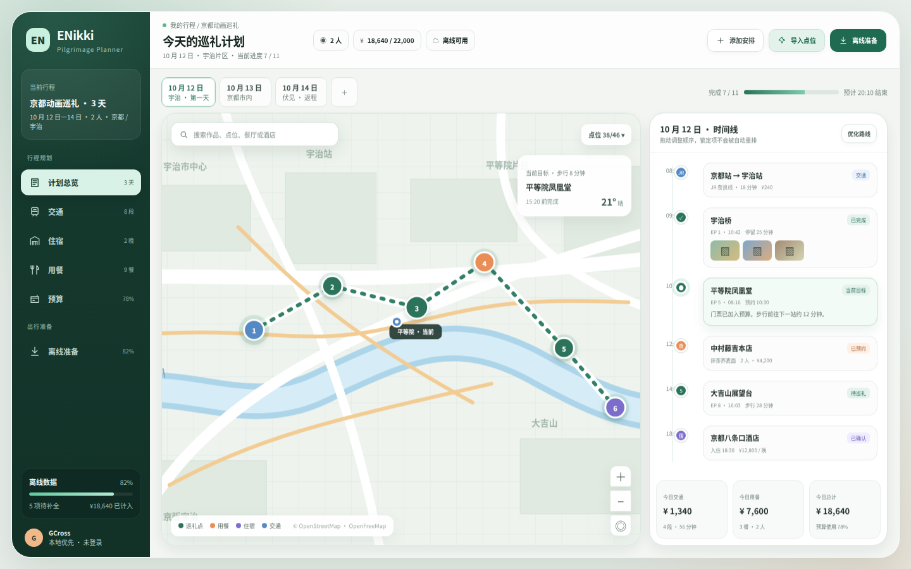

### 总览内联编辑

计划总览可以直接添加和编辑时间线安排，不需要先进入独立模块。支持巡礼点、
交通、住宿、用餐、拍照打卡和休息/备注，并包含时间、地点、双币种费用、
所属片区和提醒设置。

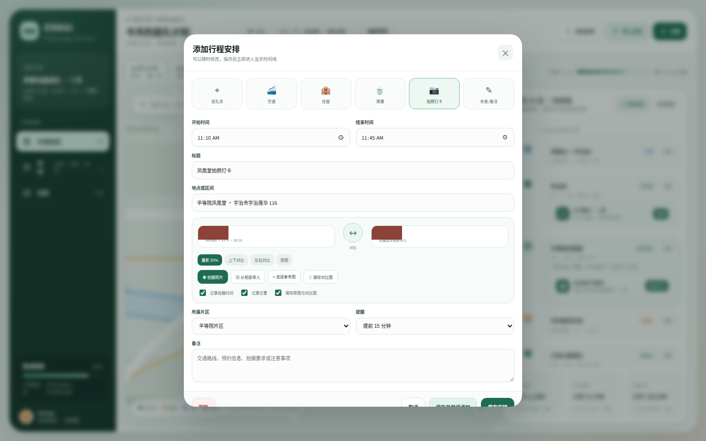

手机端使用底部编辑面板：

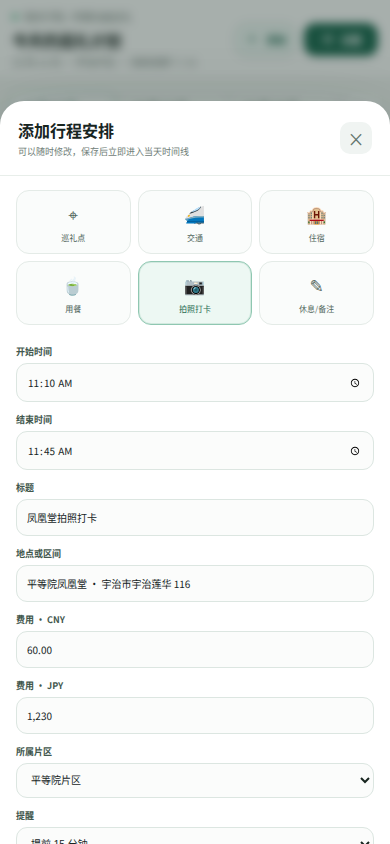

选择“拍照打卡”类型后，表单默认显示“参考图 + 实拍图”两个空图片框。

参考图支持：

- Anitabi 参考图
- 手机相册
- 本地文件

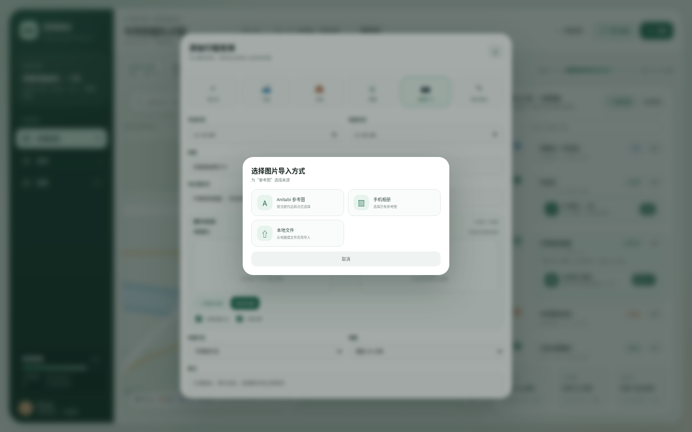

实拍图支持：

- 拍照
- 手机相册
- 本地文件

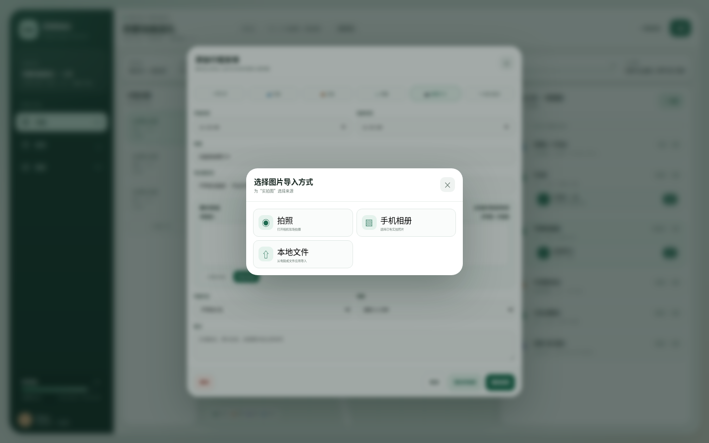

选择后的图片会填入对应框，并支持继续添加新的“参考图 + 实拍图”对比组。
填写后可使用叠影、上下、左右和原图模式，并保存对比图。

手机端实拍图来源选择：

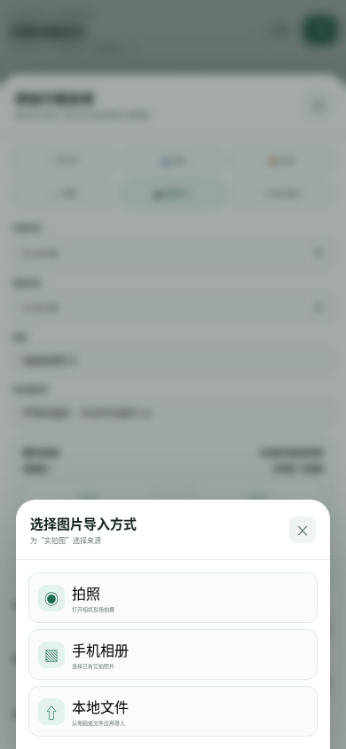

### 交通规划

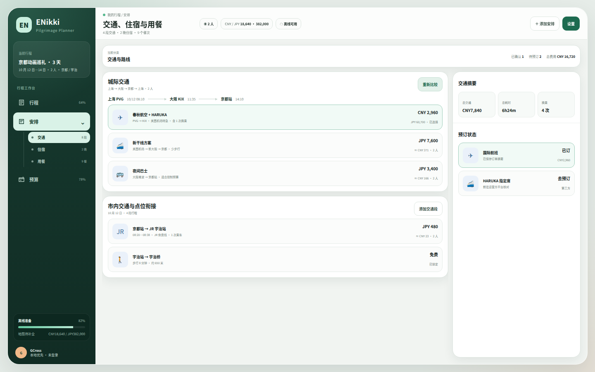

### 住宿规划

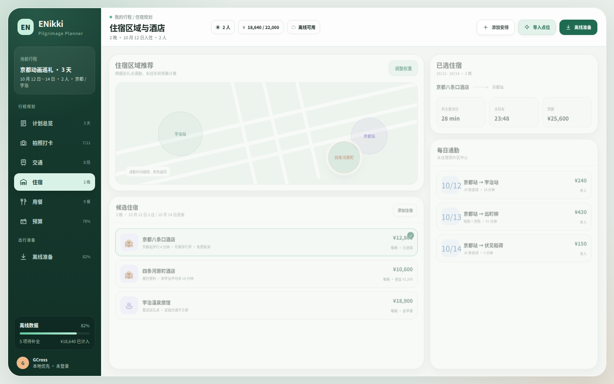

### 用餐安排

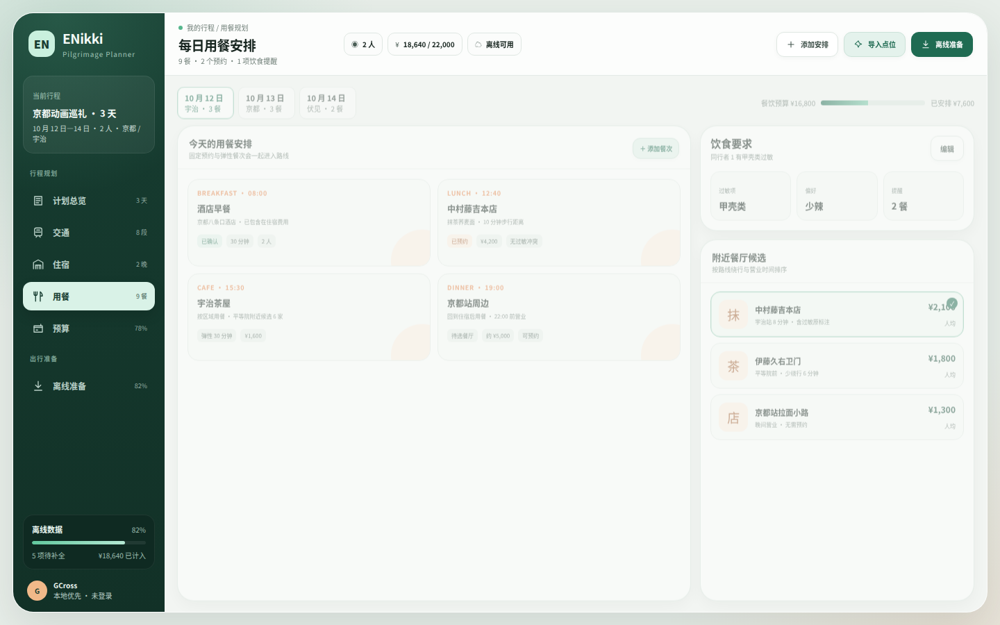

### 预算管理

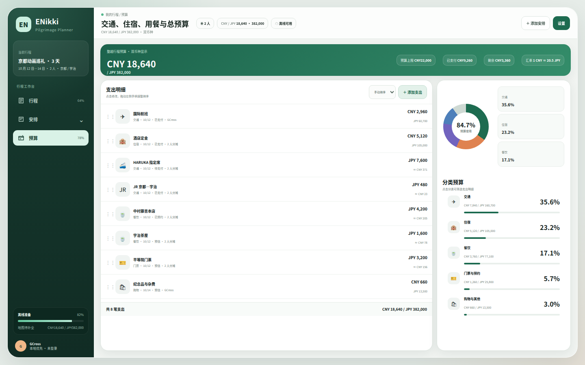

支持同时显示 CNY 和 JPY，分类、汇总、支出明细与汇率更新时间保持一致。
“添加支出”和已有支出记录都可以打开编辑窗口。

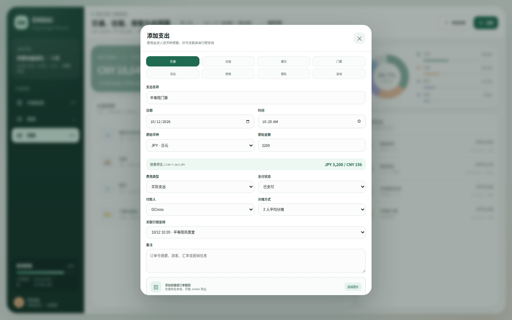

手机端使用底部编辑面板：

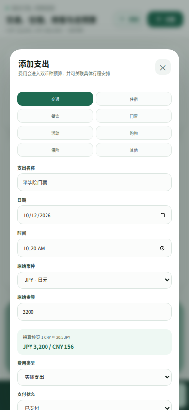

### 设置

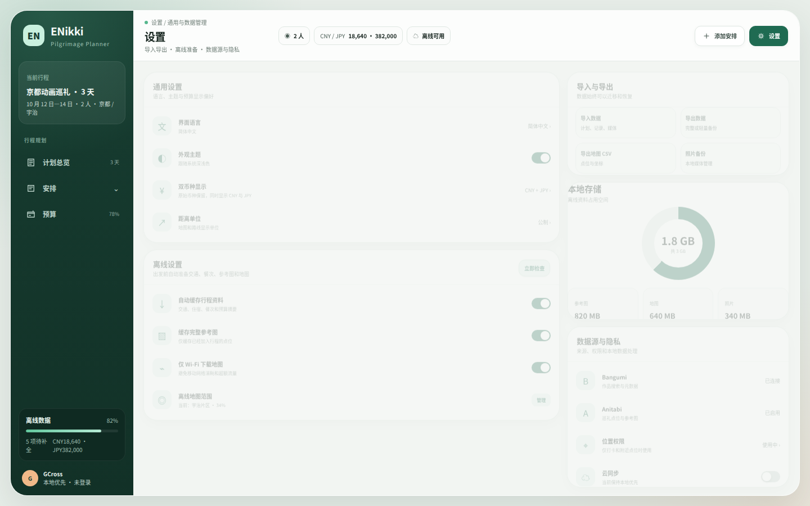

包含导入导出、离线缓存、地图缓存、数据源、权限和同步选项。

### 离线准备

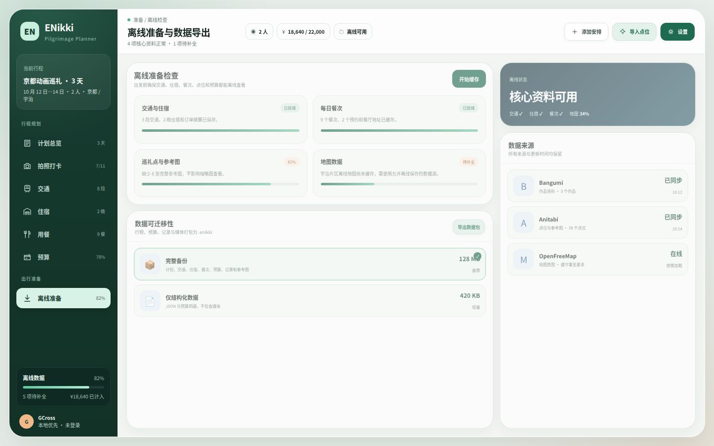

桌面七页总览见 [`preview-overview.png`](preview-overview.png)。

### 移动端

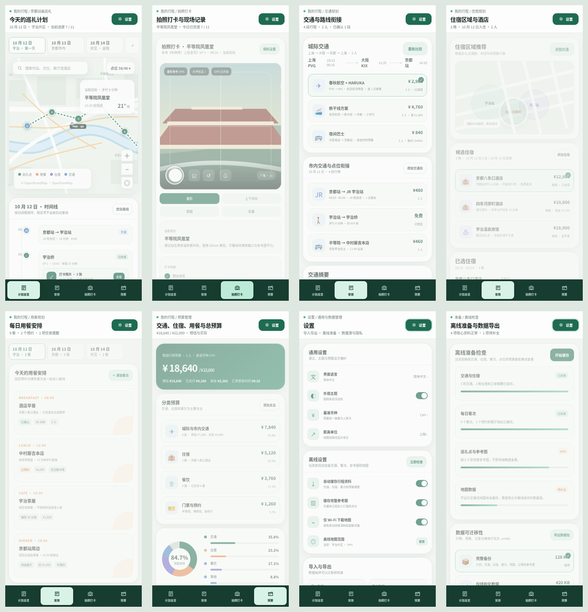

移动端采用地图优先、时间线下滑和三项底部导航布局，顶部固定“添加”和“设置”：

```text
计划 | 安排 | 预算
```

交通、住宿和用餐收进“安排”半屏面板；导入导出、离线设置、数据源和隐私统一放在右上角设置页。
七个页面分别为：

- [计划总览](preview-mobile.png)
- [交通规划](preview-mobile-transport.png)
- [住宿规划](preview-mobile-lodging.png)
- [用餐安排](preview-mobile-meals.png)
- [预算管理](preview-mobile-budget.png)
- [设置](preview-mobile-settings.png)
- [离线准备](preview-mobile-offline.png)

“安排”面板预览：

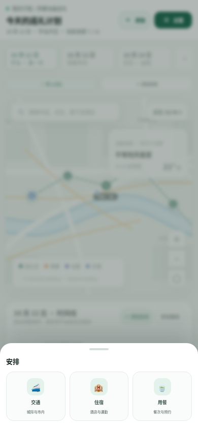

## 桌面端与手机端一致性

桌面端使用常驻侧栏，手机端使用三项底栏，并在顶部固定“添加”和“设置”入口。两端功能等价，只是
信息结构不同：

| 功能 | 桌面端 | 手机端 |
| --- | --- | --- |
| 行程总览 | 侧栏“计划总览” | 底栏“计划” |
| 交通、住宿、用餐 | 侧栏“安排”二级菜单 | 底栏“安排”半屏面板 |
| 拍照打卡 | 时间线内编辑或顶部添加 | 时间线内编辑或顶部添加 |
| 预算 | 侧栏“预算” | 底栏“预算” |
| 导入导出 | 顶部或设置页 | 设置页 |
| 离线设置 | 设置页 | 设置页 |
| 数据源与隐私 | 设置页 | 设置页 |

手机版交通、住宿和用餐页面会把摘要与预订状态前置，避免因单列布局而看起来
缺少功能。计划总览还提供“导入点位 / 添加安排”快捷操作。拍照打卡作为安排类型，不再占用一级导航。

## 原型范围

- 计划总览：地图、点位、路线、每日时间线、内联编辑和当前目标。
- 交通：城际交通、市内交通、点位衔接和预订状态。
- 住宿：住宿区域、酒店候选、入住退房和每日通勤。
- 用餐：早餐、午餐、晚餐、咖啡、预约和饮食限制。
- 预算：分类预算、CNY + JPY 双币种汇总、预估与实际支出。
- 设置：导入导出、离线缓存、数据源、权限和同步。
- 离线：交通、住宿、餐次、参考图、地图和导出检查。

当前原型使用示例数据，所有按钮和导航均为演示交互，不连接真实后端。
