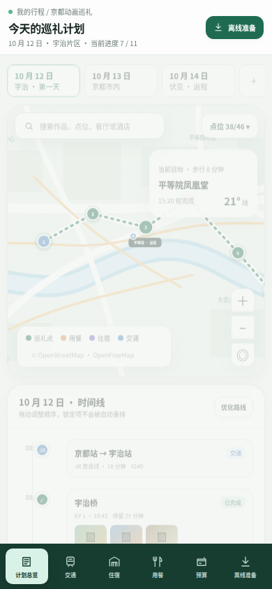

# ENikki 界面原型

本目录提供 ENikki 的高保真交互原型。

## 打开方式

直接用浏览器打开 [`enikki-ui.html`](enikki-ui.html)，无需安装依赖或启动服务。

也可以在 URL 中指定初始页面：

```text
enikki-ui.html?view=planner
enikki-ui.html?view=transport
enikki-ui.html?view=lodging
enikki-ui.html?view=meals
enikki-ui.html?view=budget
enikki-ui.html?view=offline
```

## 界面预览

### 计划总览


### 交通规划


### 住宿规划


### 用餐安排


### 预算管理


### 离线准备


桌面六页总览见 [`preview-overview.png`](preview-overview.png)。

### 移动端



移动端采用地图优先、时间线下滑和底部导航布局。

## 原型范围

- 计划总览：地图、点位、路线、每日时间线和当前目标。
- 交通：城际交通、市内交通、点位衔接和预订状态。
- 住宿：住宿区域、酒店候选、入住退房和每日通勤。
- 用餐：早餐、午餐、晚餐、咖啡、预约和饮食限制。
- 预算：分类预算、多币种汇总、预估与实际支出。
- 离线：交通、住宿、餐次、参考图、地图和导出检查。

当前原型使用示例数据，所有按钮和导航均为演示交互，不连接真实后端。
