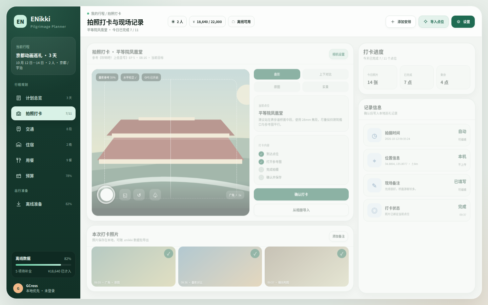
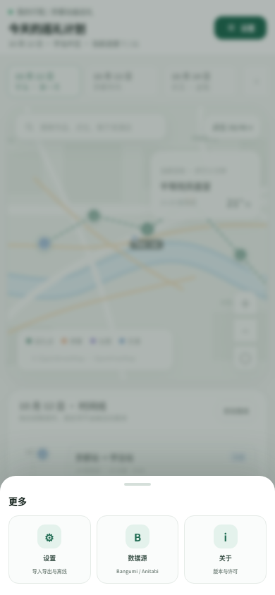

# ENikki 界面原型

本目录提供 ENikki 的高保真交互原型，覆盖桌面端和手机端的八个核心页面。

## 打开方式

直接用浏览器打开 [`enikki-ui.html`](enikki-ui.html)，无需安装依赖或启动服务。

也可以在 URL 中指定初始页面：

```text
enikki-ui.html?view=planner
enikki-ui.html?view=transport
enikki-ui.html?view=lodging
enikki-ui.html?view=meals
enikki-ui.html?view=budget
enikki-ui.html?view=settings
enikki-ui.html?view=offline
```

## 界面预览

### 计划总览


### 拍照打卡



包含参考图叠影、上下对比、相机拍摄、相册导入、打卡确认、位置记录和照片归档。

### 交通规划


### 住宿规划


### 用餐安排


### 预算管理


### 设置


包含导入导出、离线缓存、地图缓存、数据源、权限和同步选项。

### 离线准备


桌面八页总览见 [`preview-overview.png`](preview-overview.png)。

### 移动端


移动端采用地图优先、时间线下滑和五项底部导航布局：

```text
计划 | 安排 | 打卡 | 预算 | 更多
```

交通、住宿和用餐收进“安排”半屏面板，离线准备和其他设置收进“更多”面板。
八个页面分别为：

- [计划总览](preview-mobile.png)
- [拍照打卡](preview-mobile-checkin.png)
- [交通规划](preview-mobile-transport.png)
- [住宿规划](preview-mobile-lodging.png)
- [用餐安排](preview-mobile-meals.png)
- [预算管理](preview-mobile-budget.png)
- [设置](preview-mobile-settings.png)
- [离线准备](preview-mobile-offline.png)

“安排”面板预览：


“更多”面板可以直接进入设置：



## 原型范围

- 计划总览：地图、点位、路线、每日时间线和当前目标。
- 交通：城际交通、市内交通、点位衔接和预订状态。
- 住宿：住宿区域、酒店候选、入住退房和每日通勤。
- 用餐：早餐、午餐、晚餐、咖啡、预约和饮食限制。
- 预算：分类预算、多币种汇总、预估与实际支出。
- 设置：导入导出、离线缓存、数据源、权限和同步。
- 离线：交通、住宿、餐次、参考图、地图和导出检查。

当前原型使用示例数据，所有按钮和导航均为演示交互，不连接真实后端。
