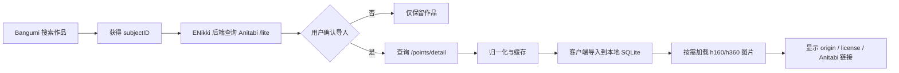

# Anitabi 数据接入评估

> 调研日期：2026-09-13  
> 调研对象：[Anitabi 地图](https://www.anitabi.cn/map)、
> [官方文档仓库](https://github.com/anitabi/anitabi.cn-document)、
> [开放 API 文档](https://github.com/anitabi/anitabi.cn-document/blob/main/api.md)

## 1. 结论

Anitabi 可以作为 ENikki 的巡礼作品、点位、截图和后段信息的候选数据源，
但不能替代地图底图，也不能成为唯一数据来源。

推荐接入方式：

- 使用官方文档中的 `api.anitabi.cn` 和 `image.anitabi.cn`。
- 通过 Bangumi `subjectID` 查询作品，再按需获取点位详情。
- ENikki 后端负责缓存、限流和数据归一化，客户端不进行全球批量抓取。
- 只把用户主动选择的行程数据缓存到本地，不把 Anitabi 全量数据打进安装包。
- 页面明确显示 Anitabi、`origin`、`originURL` 和数据许可。
- ENikki 代码继续使用 AGPL-3.0；Anitabi 内容单独标注并遵守
  CC BY-NC-SA 4.0。
- 商业化、广告、订阅、赞助换权益等场景必须重新审核授权，不能默认可用。

正式开发前，应联系 Anitabi 维护者确认生产调用限制、缓存范围、图片授权和
商业使用条件。本文件是工程评估，不替代法律意见。

## 2. Anitabi 提供什么

| 能力 | 内容 | ENikki 用途 |
| --- | --- | --- |
| 作品信息 | Bangumi ID、中文名、原名、城市、封面色 | 关联作品与建立巡礼计划 |
| 地图范围 | 默认坐标和缩放级别 | 打开作品地图时定位初始视口 |
| 点位 | 点位 ID、中日文名称、经纬度 | 加入巡礼候选和路线 |
| 截图 | 缩略图、标清图和原图地址 | 现场构图参考，按权限加载 |
| 剧集信息 | `ep` | 按话数筛选或解释点位 |
| 时间点 | `s` | 定位到对应动画时间 |
| 来源信息 | `origin`、`originURL` | 显示贡献来源并跳转原文 |
| 更新信息 | `modified` | 判断缓存是否过期 |
| 地图深链接 | `?bangumiId={subjectID}` | 跳转 Anitabi 查看完整社区地图 |
| 点位统计 | 点位数量、含图数量 | 在导入前评估数据规模 |

Anitabi 网站还包含附近点位、签到、投稿、审核、照片上传、巡礼礼仪提醒和
默认屏蔽 R 限内容等能力。这些是网站产品行为，部分内部接口没有开放文档，
ENikki 不应直接依赖。

### 2.1 Anitabi 自己的作品搜索与 Bangumi

Anitabi 前端实际分为两层搜索：

1. 地图首页先搜索 Anitabi 已加载的作品与点位索引，只覆盖站内已有巡礼数据的作品。
2. 首页没有结果时，引导用户进入 Anitabi 作品搜索。

Anitabi 作品搜索页面通过 Anitabi 后端调用以 `bgm/search` 和
`bgm/subject/{id}` 命名的接口，并提供 Bangumi 作品 URL 导入入口。
这表明 Anitabi 的作品元数据、作品详情和 `subjectID` 体系建立在 Bangumi
之上，Anitabi 自己主要维护巡礼点位、截图及其索引关系。

需要注意：

- 这些 `bgm/*` 接口是 Anitabi 内部接口，没有出现在其公开 API 文档中。
- ENikki 不应调用这些内部接口，也不应把其地址当作稳定接口。
- ENikki 应使用 Bangumi 官方接口搜索作品，再把 `subjectID` 传给 Anitabi
  官方公开的 `/bangumi/{subjectID}/lite` 和 `/points/detail`。
- 如果作品没有 Bangumi 条目，Anitabi 通常也无法提供可靠的关联 ID。

## 3. 官方 API

### 3.1 基础域名

```text
数据：https://api.anitabi.cn/
图片：https://image.anitabi.cn/
```

官方文档明确要求不要请求主域 `https://anitabi.cn/` 作为稳定资源地址，
主域不保证资源地址和数据结构稳定。ENikki 也不应调用网站内部未公开接口。

### 3.2 作品轻量信息

```http
GET https://api.anitabi.cn/bangumi/{subjectID}/lite
```

主要字段：

- `id`：Bangumi `subjectID`。
- `cn`、`title`：作品中文名和原名。
- `city`：主要城市，可能为空。
- `cover`：作品封面。
- `color`、`geo`、`zoom`：地图展示默认值。
- `modified`：毫秒时间戳。
- `litePoints`：仅前十个代表点位，不足以生成完整行程。
- `pointsLength`、`imagesLength`：点位总数和含图数量。

实际响应还出现过 `origin`、`originURL` 等字段。它们没有完整写入当前 API
文档，因此应作为可选字段解析，不应成为核心逻辑的必要条件。

### 3.3 完整点位详情

```http
GET https://api.anitabi.cn/bangumi/{subjectID}/points/detail
GET https://api.anitabi.cn/bangumi/{subjectID}/points/detail?haveImage=true
```

主要字段：

- `id`：作品内点位 ID。
- `name`：地点名称；API 文档中的轻量接口另有 `cn` 字段。
- `image`：截图缩略图地址。
- `ep`：集数；网站更新记录显示已经支持非标准集数字符串。
- `s`：截图时间点；应允许为空，并兼容非纯秒数形式。
- `geo`：经纬度数组。
- `origin`、`originURL`：来源名称与来源链接。

`haveImage=true` 只返回带图点位。完整作品可能返回很大的数组，官方文档
没有说明分页协议，因此必须限制并发、缓存完整响应并避免频繁刷新。

### 3.4 图片尺寸

文档使用 `plan` 查询参数控制图片尺寸：

```text
?plan=h160      缩略图
?plan=h360      移动端展示尺寸
删除 plan       完整尺寸，不建议在列表展示中使用
```

ENikki 默认只使用 `h160` 或 `h360`。完整尺寸仅由用户明确打开，并应遵守
Anitabi 和原始来源的许可。

### 3.5 跳转 Anitabi

```text
https://anitabi.cn/map?bangumiId={subjectID}
```

ENikki 应提供“在 Anitabi 中打开”，让用户查看完整社区数据和投稿入口，
不复制 Anitabi 的投稿、签到和社区功能。

## 4. 接入限制

### 4.1 必须按 Bangumi ID 查询

官方 API 只公开了按 Bangumi `subjectID` 查询作品点位的接口。没有公开
“全站作品搜索”或“全站点位列表”接口。

因此推荐流程是：

1. ENikki 通过 Bangumi 搜索找到作品。
2. 读取 Bangumi `subjectID`。
3. 调用 Anitabi `/lite` 判断是否有点位。
4. 用户确认导入时再调用 `/points/detail`。
5. 只缓存本次导入作品及其点位。

不能把“网页地图能看到全站数据”理解为“存在稳定全量 API”。

### 4.2 没有明确 SLA 和限流额度

实测接口返回 `Access-Control-Allow-Origin: *`，并设置了约两小时的公共缓存，
但这些响应头不是稳定性承诺。连续自动探测可能出现 Cloudflare 拦截。

ENikki 必须实现：

- 请求超时、指数退避和熔断。
- 遵循 `Cache-Control`，并利用 `modified` 跳过无变化请求。
- 设置明确、稳定的 `User-Agent` 和项目联系信息。
- 同一作品请求去重，避免多个客户端实例重复刷新。
- 后端集中缓存，不把 Anitabi 当成实时数据库。
- 遇到 `403`、`429`、`5xx` 时保留最后缓存并明确提示用户。

### 4.3 数据质量与坐标

- Anitabi 原文明确说明不严格判断内容精确性。
- 点位可能位于学校、图书馆、政府机关等敏感区域，应显示现场行为提醒。
- 官方 API 文档没有明确声明坐标参考系。工程上必须通过测试确认，
  不能擅自假设与所有地图供应商完全一致。
- 经纬度和地点名称冲突时，应保留原始数据并提示用户确认。

### 4.4 内容分级

网站默认屏蔽 R 限内容，但公开 API 文档没有说明统一的分级字段。
ENikki 不能假定 API 返回结果已经完成分级过滤，应增加独立的内容审核、
隐藏和举报机制。

## 5. 数据模型映射

| Anitabi 字段 | ENikki 模型 | 处理方式 |
| --- | --- | --- |
| `subjectID / id` | `Work.externalRefs.bangumi` | 使用 Bangumi ID 作为关联键 |
| `cn / title` | `Work.title / originalTitle` | 保留来源值和用户覆盖值 |
| `city` | `Work.primaryCity` | 可为空 |
| 点位 `id` | `SourceRecord.externalId` | 与 `workId` 组成复合唯一键 |
| `name / cn` | `Spot.name / localizedName` | 按原语言保存 |
| `geo` | `Spot.coordinate` | 转成内部坐标类型 |
| `ep` | `Spot.episode` | 使用可扩展字符串或联合类型 |
| `s` | `Spot.sceneTime` | 保留原始字符串和可解析秒数 |
| `image` | `SpotImage.remoteUrl` | 默认只存缩略图地址 |
| `origin` | `SpotImage.origin` | 必须显示 |
| `originURL` | `SpotImage.originUrl` | 提供可点击来源 |
| `modified` | `SourceRecord.modifiedAt` | 用于缓存判断 |

每个导入对象还必须记录：

```text
provider = anitabi
provider_license = CC-BY-NC-SA-4.0
imported_at
source_url
raw_payload_hash
attribution_text
```

用户对名称、坐标、说明和顺序的修改写入 ENikki 自身字段。刷新 Anitabi
数据时不得覆盖用户修改。

## 6. 推荐接入架构



接口设计应通过 `SpotSourceAdapter` 隔离：

```dart
abstract interface class SpotSourceAdapter {
  Future<SourceWork?> getWork(String externalId);
  Future<List<SourceSpot>> getSpots(
    String externalId, {
    bool imagesOnly,
  });
}
```

Anitabi 只是其中一个实现。以后替换或增加其他数据源，不影响行程、路线和
预算模型。

## 7. 缓存与离线规则

- 元数据可以按响应缓存时间短期缓存，不永久镜像全站数据。
- 完整详情只在用户需要导入某作品时获取。
- 离线缓存只保存用户主动加入行程的作品、点位、说明和缩略图。
- 不预下载所有作品图片，不批量抓取图片域名。
- 导出用户行程时，应让用户选择是否包含第三方图片。
- 如果分享文件包含 Anitabi 数据或截图，必须保留来源、作者和许可。
- 删除缓存时应清除元数据、缩略图和本地派生文件。

## 8. 许可与商业使用

Anitabi API 文档明确说明点位详情和截图按
[CC BY-NC-SA 4.0](https://creativecommons.org/licenses/by-nc-sa/4.0/deed.zh-hans)
共享，要求：

- **署名**：保留 Anitabi、`origin`、`originURL` 和相关作者信息。
- **非商业性使用**：不得用于商业目的。
- **相同方式共享**：分发改编数据时使用相同许可。

ENikki 源代码使用 AGPL-3.0，但这不会自动把 Anitabi 内容变成 AGPL 数据。
App 内必须分别展示：

```text
ENikki 源代码：AGPL-3.0
Anitabi 数据与截图：CC BY-NC-SA 4.0
动画截图原始权利：归原权利方或贡献者
```

以下行为在未取得额外授权前应视为禁止或需要法律审核：

- 出售 App、订阅解锁、广告变现或赞助换取商业权益。
- 将 Anitabi 全量点位和图片打包发行。
- 把 Anitabi 数据换许可证后作为 ENikki 自有数据发布。
- 删除 `origin`、`originURL`、贡献者和许可信息。
- 使用完整尺寸截图制作无关的宣传素材。
- 假定 Anitabi 的 CC 许可覆盖了动画截图原权利方尚未授权的部分。

如果 ENikki 未来需要商业化，建议：

1. 将 Anitabi 设计成用户可选的数据源，而不是内置数据包。
2. 询问 Anitabi 是否提供单独授权或商业接口。
3. 对点位、截图和元数据分别确认权利。
4. 允许部署者关闭 Anitabi 数据源，不影响核心行程功能。
5. 保存完整的来源审计记录。

## 9. 分阶段实施

### P0：验证

- 与 Anitabi 维护者确认生产调用、缓存、图片和许可边界。
- 编写固定响应 Fixtures，验证 `lite` 和 `points/detail` 解析。
- 确认坐标参考系和非标准 `ep`、`s` 数据。
- 完成限流、超时、重试和缓存策略测试。

### P1：只读导入

- 通过 Bangumi 搜索作品。
- 查询 `/lite` 并展示点位数、含图数和代表点。
- 用户确认后获取完整详情并导入本地行程。
- 显示来源、许可、`origin` 和“在 Anitabi 中打开”。
- 支持用户移除该数据源及其缓存。

### P2：生产优化

- 后端聚合缓存、请求队列和条件刷新。
- 支持图片代理或按授权要求直接访问图片域名。
- 增加内容审核、来源纠错和权限开关。
- 监测接口变化并对 Schema 变化提供兼容和回退。

## 10. 需要向 Anitabi 确认的问题

1. 正式产品调用 API 是否需要申请 Key、User-Agent 或额度？
2. 是否允许服务端缓存、缓存多久、是否允许离线保存？
3. 图片是否允许在客户端和导出的行程中保存或重新分发？
4. `/points/detail` 是否有分页、最大作品规模或并发限制？
5. `geo` 的坐标参考系是什么？是否有精度和更新时间字段？
6. API 是否提供 R 限或其他内容分级字段？
7. 点位贡献者和截图的署名规则是什么？
8. 项目接受赞助、广告或付费功能时，是否仍属于非商业性使用？
9. 是否允许与本项目建立正式的数据源合作或提供批量接口？
10. 接口发生破坏性变化时，是否有变更通知渠道？

在这些问题确认前，ENikki 应保持 Anitabi 为**可选、只读、可关闭**的数据源，
不能成为产品运行的单点依赖。
