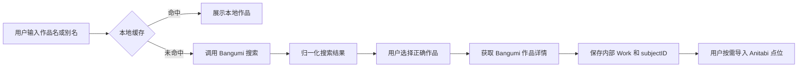

# Bangumi 作品源接入方案

> 状态：第一阶段实施决策  
> 决策日期：2026-09-14  
> 范围：作品搜索、作品详情、外部 ID 和 Anitabi 关联

## 1. 决策

ENikki 第一阶段只接入 Bangumi 作为作品搜索和元数据来源。

具体含义：

- 不接入其他作品数据库。
- 不实现跨来源聚合搜索。
- 不要求用户选择作品数据源。
- 不引入多个 provider 的访问令牌和限流系统。
- 作品搜索、作品详情和 Anitabi 关联统一使用 Bangumi `subjectID`。
- 数据层保留 `external_id` 字段，为以后扩展预留空间，但现在只有一个实现。
- Bangumi 查不到的作品允许用户手动创建，但无法自动导入 Anitabi 点位。

这个限制用于缩短第一阶段交付路径。未来是否增加其他来源，需要单独通过 ADR 决策。

## 2. 数据职责

| 数据 | Bangumi 的作用 | 备注 |
| --- | --- | --- |
| 作品搜索 | 按标题、别名和类型查询 | 第一阶段唯一搜索入口 |
| 作品详情 | 名称、原名、类型、日期、封面、简介 | 保留原始条目链接 |
| 作品类型 | 动画、书籍、游戏等 | Anitabi 主要使用动画条目 |
| Bangumi ID | 唯一关联键 | API 路径和 Anitabi 查询都使用 |
| 用户收藏状态 | 不使用 | ENikki 自己维护巡礼状态 |
| 巡礼点位 | 不提供 | 由 Anitabi 按需提供 |

Bangumi 负责作品资料，Anitabi 负责巡礼点位和截图，二者不能混淆。

## 3. 核心流程



### 3.1 搜索作品

使用 Bangumi v0 搜索接口。请求由 ENikki 后端统一发起，客户端不直接依赖
Bangumi API 地址。

请求层需要处理：

- 设置清晰、稳定的 `User-Agent`，包含项目地址和联系方式。
- 作品类型过滤，第一阶段主要使用动画、书籍和游戏。
- 分页、超时、重试、限流和错误缓存。
- 用户连续输入时使用防抖，不发送无意义请求。
- 服务端缓存搜索结果，客户端只保存最近搜索和已选作品。

Bangumi 搜索返回的是候选列表。ENikki 不直接选择第一条结果，必须让用户
确认作品，避免同名、多季、剧场版和重制版误匹配。

### 3.2 获取作品详情

用户确认搜索结果后，再获取完整作品详情。

保存范围：

- Bangumi `subjectID`；
- 中文名和原名；
- 类型和首播/发行日期；
- 封面 URL；
- 简介；
- Bangumi 条目 URL；
- 数据更新时间和获取时间。

简介和封面属于第三方内容，必须保留来源，不能改写成 ENikki 自有数据。

### 3.3 导入 Anitabi 点位

只有拥有有效 Bangumi `subjectID` 的作品，才显示“导入 Anitabi 点位”入口。

导入流程：

1. 使用 `subjectID` 查询 Anitabi `/lite`。
2. 展示点位总数、截图数量和代表点位。
3. 用户确认后查询 `/points/detail`。
4. 将 Anitabi 点位转为 `Spot` 和 `SourceRecord`。
5. 分别显示 Bangumi 与 Anitabi 的来源和许可。

如果没有 Bangumi 条目，用户仍可手动添加作品和点位，但 Anitabi 自动导入
保持不可用。

### 3.4 手动创建作品

需要支持以下情况：

- 新作品尚未录入 Bangumi。
- Bangumi 暂时不可用。
- 用户只想规划自定义行程。

手动作品的 `bangumi_id` 为空：

```text
Work.source = manual
Work.bangumi_id = null
Work.anitabi_enabled = false
```

以后关联到 Bangumi 时，需要用户确认并写入外部 ID，而不是自动覆盖作品信息。

## 4. 内部模型

ENikki 仍使用自己的 `Work.id`，不直接把 Bangumi ID 当主键：

| 字段 | 说明 |
| --- | --- |
| `id` | ENikki 内部 UUID v7 或 ULID |
| `bangumi_id` | Bangumi `subjectID`，可空 |
| `title` | 用户界面显示名 |
| `original_title` | Bangumi 原始标题 |
| `type` | 作品类型 |
| `date` | 首播或发行日期 |
| `cover_url` | Bangumi 封面地址 |
| `summary` | Bangumi 简介快照 |
| `source_url` | Bangumi 条目链接 |
| `source_updated_at` | 第三方数据更新时间 |
| `user_overridden_fields` | 用户手动修改过的字段 |

外部 ID 表仍使用 `provider + external_id` 的形式，但第一阶段只写
`provider = bangumi`。

## 5. 缓存与失效

- 搜索结果短时缓存，避免相同关键词反复请求。
- 已选作品详情持久缓存，显示最后更新时间。
- 打开行程时优先读取本地 SQLite，不要求联网。
- 用户手动编辑过的字段不能被远端刷新覆盖。
- Bangumi 不可用时保留缓存，并显示“数据可能不是最新”。
- 删除作品时同时删除其未使用的本地缓存。

具体缓存时长必须遵守 Bangumi API 条款，并根据响应头和实际调用情况调整。

## 6. 限流与容错

- 所有请求必须经过 ENikki 后端，不把 Bangumi 凭据放进客户端。
- 后端按全局而不是按单用户控制并发。
- 遇到超时、`429` 或 `5xx` 使用指数退避和熔断。
- 搜索结果失败时允许用户重试或手动创建作品。
- 请求日志不得记录用户完整搜索历史；必要时只保留匿名统计。
- API Schema 变化必须通过契约测试尽早发现。

## 7. 许可与来源

- 保存并展示 Bangumi 条目 URL。
- 作品简介和封面保留来源说明。
- 不把 Bangumi 内容打包进代码仓库或测试 Fixtures。
- 测试使用人工构造数据或已明确许可的固定样例。
- Anitabi 点位继续遵守其独立的 CC BY-NC-SA 4.0 许可。
- 商业化和数据再分发前重新审查 Bangumi 及 Anitabi 的条款。

## 8. 实施顺序

### P0

- 确认 Bangumi API 搜索、详情和认证要求。
- 定义 `Work` 模型和 `bangumi_id`。
- 建立 Bangumi 适配器、缓存和错误映射。
- 完成同名、多季、剧场版和特殊字符搜索测试。

### P1

- 实现作品搜索和用户确认流程。
- 实现作品详情、手动创建和 Bangumi 链接导入。
- 只有确认 `bangumi_id` 后开放 Anitabi 导入。
- 完成离线缓存和用户字段保护。

### P2

- 根据真实使用问题优化搜索排序和别名匹配。
- 评估是否需要 Bangumi OAuth、收藏同步或用户数据。
- 评估是否引入其他作品源；当前阶段不做相关设计。

## 9. 暂缓的其他来源

其他作品数据库在当前阶段不开发、不测试、不作为后备依赖。未来重新评估时，
必须单独确认以下内容：

- API 稳定性、认证方式和限流；
- 数据与封面许可；
- 商业使用条件；
- 与 Bangumi ID 的映射方式；
- 是否值得增加产品复杂度。

当前唯一的后备方案是：**用户手动创建作品**。
