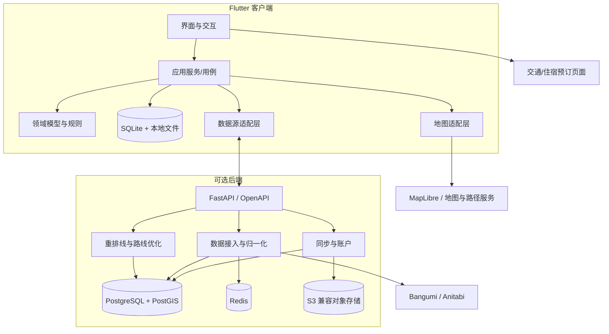

# ENikki 实施方案

> 状态：建议稿 v0.1  
> 适用范围：客户端、后端、数据、路线规划、离线能力、同步与发布  
> 本文给出推荐架构和交付顺序，不代表所有技术决策已经最终冻结。进入开发前，关键决策应通过 ADR 固化。

## 1. 实施结论

ENikki 不采用“六个平台六套客户端”的方式，也不在没有真实数据时先做微服务集群。推荐采用以下主线：

| 领域 | 推荐方案 | 选择理由 |
| --- | --- | --- |
| 客户端 | Flutter + Dart | 五个主流平台复用率高；HarmonyOS 可通过 OpenHarmony Flutter 适配 |
| 客户端状态 | Riverpod | 可测试、依赖注入清晰，适合本地优先和多数据源场景 |
| 路由与导航 | go_router | 支持移动端、桌面端和深链接 |
| 本地数据库 | SQLite + Drift | 跨平台稳定，支持迁移、事务和离线查询 |
| 序列化 | Freezed + json_serializable | 明确数据模型，减少手写序列化错误 |
| 地图 | 地图适配层 + MapLibre 系列 | 避免绑定单一商业地图；允许原生、WebView 和降级实现 |
| 后端 | Python + FastAPI | 适合数据接入、地理计算和路线优化，开发速度快 |
| 服务端数据库 | PostgreSQL + PostGIS | 成熟的空间索引、地理查询和事务能力 |
| 缓存与任务 | Redis + 异步任务队列 | 处理数据同步、抓取限流、重任务和缓存 |
| 文件存储 | S3 兼容对象存储 | 保存用户同步照片和导出文件，可自托管 MinIO |
| 路线计算 | 客户端启发式算法，服务端 OR-Tools | 小规模离线可算，大规模和复杂约束交给服务端 |
| 地图路径 | OSRM 或 Valhalla | 支持步行、骑行、驾车等基础路径计算 |
| 公交路径 | OpenTripPlanner + GTFS | 仅对具备合法 GTFS 数据的地区开放完整公交规划 |
| 导航 | 系统地图或第三方地图深链接 | 实时路况、公交到站和现场导航不由 ENikki 重建 |
| 发布 | GitHub Actions | 自动检查、构建、签名检查和 Release 产物 |
| 协议 | AGPL-3.0 | 客户端代码和后续网络服务均按同一开源协议发布 |

没有一个技术栈可以零成本覆盖全部六个平台。Flutter 是当前复用率、生态和落地成本之间较优的折中，但 HarmonyOS 仍需单独验证地图、定位、相机、文件系统和后台任务插件。

## 2. 架构目标与原则

### 2.1 目标

- 同一份行程可以在桌面端和移动端使用，数据格式一致。
- 无网络时可以创建、编辑、查看和导出核心行程。
- 地图、数据源、导航和预订平台可以替换，不侵入核心业务。
- 用户数据可以被导出和迁移，不被服务端锁定。
- 路线计算结果可以解释，用户手动调整后不会被自动算法覆盖。
- 后期增加账号、同步和社区数据时，不需要重写核心领域模型。

### 2.2 非目标

- 不直接售卖车票、机票、酒店或处理支付。
- 不保证实时价格、库存、营业时间和班次准确。
- 不在首版实现全球范围的实时公交导航。
- 不抓取或重新分发没有明确授权的点位、截图和价格数据。
- 不为了“微服务”而拆分服务；先保持模块化单体。

## 3. 总体架构



客户端是完整产品，不依赖后端才能启动。后端提供三类增量价值：

1. 归一化并缓存公开数据源，减少客户端适配成本和第三方 API 压力；
2. 处理大规模路线优化、跨设备同步和媒体备份；
3. 提供稳定的数据版本、纠错流程和服务端来源追踪。

## 4. 客户端方案

### 4.1 技术选型

- Flutter 作为唯一主客户端技术栈。
- Riverpod 管理依赖和状态，不把业务规则写进 Widget。
- go_router 管理页面和深链接。
- Drift 管理结构化本地数据；原始照片和大文件放文件系统。
- 网络层使用 Dio 或 `http`，统一处理超时、重试、缓存和 User-Agent。
- 模型使用 Freezed/JSON，数据交换格式保持明确版本号。
- 通过 `build_runner` 生成序列化和数据库代码。
- 代码分析采用严格 lint；提交前执行格式化、分析和测试。

### 4.2 客户端分层

```text
lib/
├── app/                    # 应用启动、主题、路由、全局依赖
├── features/
│   ├── discovery/          # 作品与点位发现
│   ├── planner/            # 行程、排线、交通与住宿规划
│   ├── meals/              # 每日餐次、餐厅候选与预约信息
│   ├── budget/             # 预算与支出
│   ├── journey/            # 离线行程、导航与打卡
│   ├── records/            # 巡礼记录、照片与分享
│   └── settings/           # 设置、数据导入导出与隐私
├── core/
│   ├── domain/             # 纯 Dart 实体、值对象、领域规则
│   ├── application/        # 用例、命令和查询
│   ├── data/               # Repository 实现、本地数据库、远端 API
│   ├── platform/           # 地图、定位、相机、文件、深链接接口
│   └── ui/                 # 设计系统、通用组件、错误与加载状态
└── main.dart
```

规则：

- `domain` 不依赖 Flutter、SQLite、网络库或地图 SDK。
- `application` 只编排用例，不直接操作数据库或渲染 UI。
- `data` 实现仓储接口，负责本地/远端数据合并。
- 平台差异通过接口注入，例如 `MapEngine`、`NavigationLauncher`、`LocationService`、`MediaStore`。
- 首版保持一个 Flutter 包。只有边界稳定且确有复用时，再拆成独立 package。

### 4.3 跨平台发布顺序

推荐按真实使用价值和技术风险分阶段发布：

| 阶段 | 平台 | 目的 |
| --- | --- | --- |
| P1 | Android | 现场巡礼、离线使用的主要载体 |
| P1 | Windows | 桌面端长时间规划、地图和大屏编辑 |
| P2 | Linux、macOS | 完成桌面覆盖 |
| P2 | iOS | 完成主流移动端覆盖 |
| P3 | HarmonyOS | 在 OpenHarmony Flutter 和关键插件验证通过后发布 |

代码从第一天就避免绑定单一平台，但不在没有测试设备的平台上承诺“已支持”。

## 5. 核心领域模型

所有实体使用全局唯一 ID，时间统一存 UTC，坐标统一使用 WGS84。金额使用“最小货币单位整数 + ISO 4217 币种”，禁止用浮点数保存钱。

| 实体 | 关键字段 | 说明 |
| --- | --- | --- |
| `Work` | id、标题、别名、类型、外部引用 | 动画、漫画、游戏、小说等作品 |
| `SourceRecord` | source、external_id、URL、许可、更新时间 | 保存来源，不把外部数据伪装成用户数据 |
| `Spot` | id、坐标、说明、作品引用、约束、状态 | 巡礼点；一个点位可关联多个作品 |
| `SpotImage` | id、来源、许可、缓存路径、版权说明 | 参考图，必须独立记录授权状态 |
| `Trip` | id、日期、时区、同行人、币种显示、状态 | 一次巡礼行程 |
| `TripDay` | id、日期、起点、终点、住宿区域 | 行程中的一天 |
| `PlanItem` | id、点位、顺序、停留时间、锁定状态 | 每天的具体安排；锁定后算法不得移动 |
| `RouteLeg` | id、交通方式、距离、时长、费用、来源 | 两个安排之间的移动段 |
| `TransportOption` | id、类型、时刻、价格、预订链接、来源 | 可选的城际或市内交通 |
| `LodgingOption` | id、区域、日期、价格区间、预订链接 | 只保存规划信息和跳转地址 |
| `MealPlan` | id、日期、餐次、时间窗、地点、预约状态 | 行程中的一次用餐安排 |
| `MealOption` | id、餐厅、坐标、营业时间、人均、预约链接 | 可比较的餐厅候选 |
| `BudgetItem` | id、类别、金额、币种、预估/实际 | 交通、住宿、餐饮、门票等预算与支出 |
| `VisitRecord` | id、点位、到达时间、状态、备注 | 打卡与现场反馈 |
| `CheckInRecord` | id、点位、照片、时间、位置、备注 | 一次拍照打卡记录 |
| `MediaAsset` | id、文件哈希、类型、位置、关联对象 | 照片、视频和导出文件 |
| `Revision` | entity_id、revision、device_id、更新时间 | 本地与服务端同步的基础 |

### 5.1 外部数据隔离

外部来源的数据必须先转换为内部规范化模型，再与用户数据合并。至少要区分：

- 第三方原始值；
- ENikki 归一化值；
- 用户人工修正值；
- 数据来源、许可和更新时间。

用户修改不得被下一次数据同步无声覆盖。每次导入应生成可撤销的变更集。

## 6. 核心流程实现

### 6.1 作品与点位发现

1. 客户端优先查询本地 SQLite 缓存。
2. 缓存缺失或过期时，通过后端统一接口查询公开数据源。
3. 后端适配器解析来源，执行去重和坐标校验，写入 PostGIS。
4. 客户端保存规范化数据、来源信息和过期时间。
5. 用户手动修改时写入 `user_override`，同步更新只更新未被覆盖的字段。

第一阶段作品搜索和元数据只使用 Bangumi，内部仍使用独立 Work ID，
不能把 Bangumi ID 当作核心主键。具体接入流程见
[`BANGUMI_INTEGRATION.md`](BANGUMI_INTEGRATION.md)。

MiriaGo 的用户流程研究和取舍见
[`MIRIAGO_RESEARCH.md`](MIRIAGO_RESEARCH.md)。

地图点位按视口和缩放级别查询，不能一次性把全球点位加载到内存。低缩放级别使用聚合点，高缩放级别才加载点位详情。

#### 6.1.1 计划总览内联编辑

计划总览必须可以直接增删改巡礼点、交通、住宿、用餐、拍照打卡和备注。
拍照打卡不作为独立一级导航，而是通过“添加安排”或已有巡礼点的“编辑”进入。
每种安排使用统一 `PlanItem` 时间线模型，并通过命令完成事务写入、冲突校验、
预算重算和离线状态更新。移动端使用底部编辑面板，桌面端使用编辑抽屉或弹窗。

#### 6.1.2 软件内地图查看与选点

第一阶段必须支持在 ENikki 内直接查看巡礼地图并选择点位，不能要求用户跳转到
Anitabi 网页后再抄录坐标。

实现方式：

- ENikki 使用自己的地图引擎渲染底图，Anitabi 只提供点位和截图数据。
- 用户从 Bangumi 选择作品后，可按需获取 Anitabi 完整点位。
- 点位按当前作品的默认坐标、缩放级别和主要城市打开。
- 点位以聚合标记显示，放大后展示单点、名称和缩略图。
- 点击点位显示截图、地点名、集数、时间点、来源和 Anitabi 链接。
- 支持按集数、是否含截图、是否已加入行程和内容状态筛选。
- 支持单击选择、多选、全选当前筛选结果和按当前地图视野选择。
- 已选择的点位可加入候选清单，也可直接加入指定日期或片区。
- 加入前执行重复检测，已存在的点位显示冲突提示而不是重复创建。
- 长按地图可手动添加自定义点位，并自动关联当前作品。
- 用户可以取消导入 Anitabi 点位，也可以单独删除已导入的点位。
- 没有 Bangumi `subjectID` 的作品只能手动选点，不能自动加载 Anitabi 点位。

底部面板提供“地图”和“列表”两种视图，选择状态在两种视图间保持一致。
移动端以底部抽屉操作为主，桌面端使用侧边栏和地图详情面板。

离线时只显示已经缓存的点、截图和行程数据，并明确提示地图或点位数据可能
不完整。不因为地图离线功能而违规预下载 OSM 官方瓦片。

验收标准：

- 用户无需离开 ENikki，即可从 Bangumi 作品进入巡礼地图。
- 用户可以查看点位详情，选择多个点位并加入指定日程。
- 重启或离线后，已选点位和来源信息仍然存在。
- 用户可以明确分辨 ENikki 地图、Anitabi 数据来源和第三方底图。

### 6.2 行程排线

路线规划分成六步：

1. 收集候选点位，过滤已关闭、禁止进入或不满足行程条件的点。
2. 按城市、交通圈和地理距离聚类，形成每天的候选区域。
3. 计算点位之间的步行、驾车、骑行或公交时间矩阵。
4. 在时间窗、开放时间、用餐预约、停留时长、预算和体力限制下安排顺序。
5. 计算路线总时长、总费用、等待时间和未命中优先级。
6. 展示可解释结果，允许用户拖动、锁定或排除点位后重新计算。

算法分阶段实现：

- 少于约 15 个点：最近邻生成初解，再用 2-opt 修正。
- 15 至 50 个点：模拟退火或遗传算法，加入时间窗和锁定约束。
- 大规模、多日、多车辆或复杂约束：发送到服务端使用 OR-Tools 求解。
- 没有路径服务数据时：使用球面距离和固定速度估算，并明确标注为估算值。
- 用户锁定的安排是不可变约束，任何优化都不能移动它们。

所有路线结果必须包含“来源、更新时间、计算假设和精度等级”，避免用户把估算值误认为官方班次。

### 6.3 交通、住宿与用餐

交通、住宿、用餐和预算共同属于 P1 可执行行程闭环，完整设计见
[`TRIP_PLANNING.md`](TRIP_PLANNING.md)。

程序结构、领域模型、数据库、排线器和预算实现见
[`TRIP_PLANNING_ARCHITECTURE.md`](TRIP_PLANNING_ARCHITECTURE.md)。

- 基础路径由 OSRM/Valhalla 计算，公交路线由 OpenTripPlanner 在具备合法 GTFS 的地区计算。
- 实时公交、铁路时刻、价格和房态优先跳转到第三方应用或网站。
- 预订链接通过 `BookingProvider` 适配层生成，只允许白名单域名。
- 不在 WebView 中收集第三方账号、银行卡或订单密码。
- 可将用户手动确认的价格和订单摘要保存到本地，但不抓取订单页面。
- 每个价格和班次记录都必须带来源、币种和更新时间。
- 每日餐次进入时间线，餐厅、预约、饮食限制和排队时间参与排线。
- 餐厅预约、交通票务和住宿预订统一走第三方深链接，不在应用内交易。

### 6.4 预算

- 金额使用整数最小单位，提供统一 `Money` 值对象。
- 每笔费用保留原币种，并可同时计算基准币种和第二显示币种。
- 汇率保存“数值、基准币种、目标币种、来源、生效时间”。
- 预算分为预估与实际，支持固定费用、按人分摊和按比例分摊。
- 汇总计算放在领域层，并覆盖跨币种、舍入和负数输入测试。
- 汇率 API 不可用时保留最后成功值，同时显著标注更新时间。

### 6.5 离线行程

离线数据分成三层：

1. 结构化数据：SQLite，保存作品、点位、行程、预算和记录。
2. 媒体文件：文件系统，使用 SHA-256 内容寻址，避免重复缓存。
3. 地图数据：可缓存的 PMTiles/地图瓦片或明确允许离线保存的数据。

导出格式建议使用 `.enikki` 文件，本质是带清单的 ZIP：

```text
manifest.json
data/trip.json
data/records.jsonl
media/<sha256>.<ext>
checksums.sha256
```

`manifest.json` 包含 `schema_version`、创建者、创建时间、设备信息和内容哈希。导入必须校验版本、路径穿越、文件大小和校验和。

### 6.6 拍照打卡与媒体

打卡流程：

1. 从当前目标点位直接进入打卡页面。
2. 加载该点位对应的 Anitabi 参考图和作品信息。
3. 选择参考图叠影、上下对比、原图或实景模式。
4. 使用相机拍摄，或从系统相册导入已有照片。
5. 预览照片，允许重拍、删除、裁剪和填写现场备注。
6. 按需记录拍摄时间和位置，位置不是完成打卡的强制条件。
7. 确认后将照片绑定到行程、作品、点位和巡礼记录。
8. 更新点位为“已完成”，并选择下一个待巡礼目标。

媒体模型至少包含 `CheckInRecord`、`MediaAsset` 和参考图关联。记录保存作品名、
点位名和参考图来源快照，删除或修改源数据后历史仍可查看。

隐私与实现要求：

- 定位权限按需请求，只在用户进入打卡、附近点位或路线跟随功能时启用。
- 照片默认保存在用户设备；只有开启同步后才上传。
- 分享前支持删除精确 GPS、订单信息、同行者姓名和人脸相关信息。
- 后台任务只做用户明确授权的照片归档、缓存或同步，不持续追踪位置。
- 媒体上传使用预签名 URL，服务端不经过应用服务器中转大文件。

### 6.7 同步

首版不做账号同步，先保证本地数据完整和可导入导出。第二阶段再引入同步：

- 每个实体带 `revision`、`deleted_at` 和 `device_id`。
- 客户端记录追加式操作日志，而不是只上传最终快照。
- 普通实体按字段合并；顺序字段和预算项冲突采用确定性规则并要求用户确认。
- 删除使用 tombstone，防止离线设备把旧数据重新上传。
- 同步成功后只清理已确认的操作日志。
- 服务端提供完整导出和账号删除，满足数据可迁移及隐私要求。

## 7. 后端方案

后端采用模块化单体，不在一开始拆分多个服务。

服务端的 P1/P2 边界、部署和离线降级见
[`SERVER_ARCHITECTURE.md`](SERVER_ARCHITECTURE.md)。

### 7.1 模块

- `catalog`：作品、别名、点位、来源和去重。
- `sync`：账户、设备、操作日志和对象存储授权。
- `routing`：路径矩阵、路线优化和结果解释。
- `provider`：地图、交通、汇率、预订链接等第三方适配器。
- `moderation`：举报、纠错、下架和审计。
- `admin`：数据源同步、任务监控和人工审核。

### 7.2 初步 API

```text
GET    /v1/works
GET    /v1/works/{work_id}
GET    /v1/works/{work_id}/spots
GET    /v1/spots?bbox=...
POST   /v1/route-plans
POST   /v1/route-plans/{id}/optimize
POST   /v1/sync/operations
GET    /v1/sync/changes?cursor=...
POST   /v1/media/presign
GET    /v1/providers/booking-links
```

API 使用 OpenAPI 生成文档，所有响应带版本和来源信息。需要长时间执行的任务返回任务 ID，通过队列异步处理，避免 HTTP 长连接。

### 7.3 数据接入

- 每个来源单独实现 `SourceAdapter`，包含限流、缓存、重试、许可和 User-Agent 配置。
- 原始响应保存在受控对象存储中，规范化结果进入 PostgreSQL/PostGIS。
- 经纬度异常、重复点位、无授权图片和过期链接进入审核队列。
- 数据同步必须可重放、可追踪、可回滚。
- 第三方 API 不可用时，服务端继续提供最后已验证的缓存版本，不伪造实时数据。

Anitabi 的开放接口、缓存策略、数据映射和许可边界见
[`ANITABI_INTEGRATION.md`](ANITABI_INTEGRATION.md)。

### 7.4 部署

开发环境使用 Docker Compose 启动 FastAPI、PostgreSQL/PostGIS、Redis、MinIO 和反向代理。
生产环境根据实际规模选择单机 Compose 或容器平台，不提前引入 Kubernetes。

## 8. 地图与地理数据

地图是六端实现中最容易产生平台分裂的部分，必须抽象为 `MapEngine` 接口，核心业务只传递领域对象，不直接调用具体 SDK。

推荐优先级：

1. Android/iOS：优先验证 MapLibre Native。
2. WebView 能力稳定的平台：可使用 MapLibre GL JS 作为统一降级实现。
3. Linux/Windows/macOS：在 MapLibre 桌面插件成熟前，完成 WebView 和栅格地图两组技术验证。
4. HarmonyOS：先验证地图、定位、文件缓存和手势插件，再决定是否发布。

### 8.1 地图能力与数据来源

地图不是一个单一来源，至少分为以下六类：

| 能力 | 推荐主来源 | 说明 |
| --- | --- | --- |
| 底图数据 | OpenStreetMap | 遵循 ODbL，保留 OpenStreetMap 署名 |
| 底图托管 | OpenFreeMap；生产可选用 Protomaps/PMTiles | 开发期优先 OpenFreeMap，离线验证使用 PMTiles |
| 地图渲染 | MapLibre Native / MapLibre GL JS | 只负责渲染，不提供点位、地址或路线数据 |
| 地理编码 | 自托管 Photon 或 Nominatim | 不在客户端直接重压公共 Nominatim 服务 |
| 普通地点 | OSM POI 数据 | 营业时间等信息不完整时必须显示来源和时间 |
| 巡礼点位 | ENikki 数据、Anitabi 等社区来源 | 点位截图和元数据必须单独确认授权 |
| 步行/骑行/驾车 | OSRM 或 Valhalla | 基于 OSM 数据，自托管或使用合规供应商 |
| 公交路线 | OpenTripPlanner + 地区 GTFS | 只对已取得合法 GTFS 数据的地区启用 |
| 实时导航 | 系统地图或第三方地图深链接 | 实时路况、到站和现场导航不自行模拟 |

### 8.2 分阶段选择

- P0 技术验证：MapLibre + OpenFreeMap，验证 Android、Windows 和 HarmonyOS 的渲染与交互。
- P1 离线闭环：使用 Protomaps/PMTiles 或允许离线保存的自托管数据，禁止预下载开放式 OSM 瓦片。
- P2 正式服务：自托管 OpenFreeMap/MapLibre 样式、Photon/Nominatim、OSRM/Valhalla；按地区接入商业地图适配器。
- 公交覆盖：先在日本及其他有合法 GTFS 数据的地区试点，其余地区跳转 Google Maps、Apple Maps 或本地导航应用。

### 8.3 使用限制

- `tile.openstreetmap.org` 是社区公共服务，不保证 SLA，并明确禁止批量下载、预取和离线打包；
  ENikki 不应把它作为正式生产或离线地图源。
- 如果使用 MapTiler、Mapbox、高德、腾讯、百度等商业服务，需要分别遵守其
  离线缓存、署名、坐标体系和区域授权要求。
- 中国地图服务可能使用 GCJ-02 或 BD-09 坐标；内部统一使用 WGS84，
  进入平台适配层前再转换，禁止混用坐标系。
- 离线底图必须在服务条款允许的前提下由 ENikki 或用户自行构建，并保留数据署名。

导航仍然交给系统地图或第三方地图应用。ENikki 负责规划、解释和跳转，不负责重建全球实时导航。

## 9. 安全、隐私与开源合规

- 所有网络请求启用 TLS，禁止在客户端硬编码第三方密钥。
- OAuth 使用系统浏览器和 PKCE，不保存第三方密码。
- 令牌进入系统安全存储，日志不得记录令牌、精确位置和订单信息。
- 依赖执行许可证扫描，确认与 AGPL-3.0 兼容。
- 支持导出、删除和注销账号；删除应覆盖数据库记录、对象存储和备份策略允许的范围。
- 用户提交内容需要举报、纠错、撤回和版权下架流程。
- 第三方地图、图片、交通、住宿和餐饮数据继续适用其原许可证。
- 如果部署修改后的服务端，必须按 AGPL-3.0 向网络用户提供对应源代码。
- **iOS 发布前必须单独进行许可证审核。** Apple App Store 的 DRM 和附加条款可能与
  AGPL-3.0 存在冲突；可能需要在“不上 App Store”“增加许可证例外”或“调整授权策略”
  之间做决定，不能等到发布前才处理。

## 10. 分阶段实施

### P0：基础与技术验证

目标：证明核心路线可行，避免在错误技术栈上投入大量 UI。

交付：

- 建立 Flutter 工程、分析规则、格式化、测试和 CI。
- 建立 ADR，记录 Flutter、地图、本地数据库和后端选型。
- 建立交通、住宿、餐次、预算和同行者模型，验证金额、币种与跨天日期计算。
- 完成 Android、Windows 和 HarmonyOS 的地图/定位最小验证。
- 完成 SQLite 迁移、离线读写和 10 万点位视口查询测试。
- 完成一个包含 10 个点位的离线排线原型。
- 完成 Bangumi 和 Anitabi 的条款、接口与可用性评估。
- 明确 iOS AGPL 发布路径。

验收：真机或桌面端可以在地图上添加点位、保存行程、重启恢复、完成一次路线重排并导出文件。

### P1：可执行行程闭环

目标：用户能独立完成“选点 → 排线 → 交通 → 住宿 → 用餐 → 预算 → 出发 → 打卡 → 导出”。

交付：

- Android 和 Windows 客户端。
- 作品/点位手动添加、编辑和导入。
- 地图聚合、点位详情、每日路线、总览内联编辑和手动调整。
- 基础步行/驾车时间估算与外部导航跳转。
- 城际交通、市内交通、住宿区域和每晚住宿安排。
- 每日早餐、午餐、晚餐和咖啡，支持餐厅候选、预约状态与饮食限制。
- CNY + JPY 等双币种预算，以及交通、住宿、餐饮、门票等分类支出。
- 离线缓存、拍照打卡、参考图叠影、照片关联和 `.enikki` 导入导出。
- GitHub Actions 构建、自动测试和签名检查。

验收：使用 20 个点位创建三天行程，包含往返城际交通、市内交通、住宿、每日三餐和多币种预算；断网后完成浏览、打卡和备注；导出后可在另一台设备恢复。

### P2：完整巡礼体验

目标：形成可公开测试的完整产品。

交付：

- 后端数据目录、Bangumi/Anitabi 适配器和来源追踪。
- 公交路线、开放时间、时间窗和复杂度约束。
- 服务端路线优化与结果解释。
- 可选账号、跨设备同步、媒体备份和冲突恢复。
- Linux、macOS、iOS 客户端。
- 隐私政策、内容政策、错误报告和版本迁移机制。
- 无障碍、国际化和日文界面。

验收：数据源更新不会覆盖用户编辑；多设备离线修改可以合并或明确提示冲突；所有外部价格和班次都有来源与时间。

### P3：HarmonyOS 与开放生态

目标：完成剩余平台，并允许第三方扩展。

交付：

- HarmonyOS 客户端。
- 稳定数据导入格式和开放 API。
- 插件或来源适配器 SDK。
- 社区纠错、审核和多人协作能力。
- 自托管部署文档和 AGPL 源码提供流程。

验收：至少一个第三方适配器可独立于主仓库开发和升级，不影响核心客户端。

## 11. 测试与质量门槛

| 层级 | 必测内容 |
| --- | --- |
| 领域单元测试 | 交通衔接、住宿日期、餐次时间、双币种预算、汇率、路线约束、打卡状态、数据迁移 |
| 数据测试 | 外部响应解析、异常坐标、重复点位、断网和重试 |
| Widget 测试 | 表单、地图控制、行程拖动、空状态和错误状态 |
| 集成测试 | 导入 → 规划 → 离线 → 打卡 → 导出完整链路 |
| 性能测试 | 10 万点位视口查询、1000 个行程项、弱网和低内存 |
| 安全测试 | 深链接、路径穿越、文件导入、密钥和权限边界 |
| 兼容测试 | 目标桌面系统、Android 版本、iOS 版本和 HarmonyOS |

质量门槛：

- 主要分支必须通过格式化、静态分析和单元测试。
- 数据迁移必须有升级和回滚测试。
- 任何价格、班次和路线功能都必须有来源字段。
- 涉及位置、照片、账号和同步的 PR 必须完成隐私检查。
- 发布包必须生成 SBOM 和第三方许可证清单。

## 12. 开发与发布流水线

GitHub Actions 建议拆分为：

- `client-check`：格式化、分析、单元测试、Widget 测试。
- `android-build`：构建和签名检查。
- `desktop-build`：Windows/macOS/Linux 构建矩阵。
- `ios-check`：无签名构建检查，正式签名使用受保护环境。
- `ohos-build`：HarmonyOS 构建与 HAP 产物检查。
- `server-check`：API 测试、迁移、依赖和许可证扫描。
- `release`：基于 `v*` 标签生成 Release 和校验和。

签名密钥、Apple 凭据、地图服务密钥和数据库凭据只保存在 GitHub Secrets 或部署环境，不进入仓库。

## 13. 主要风险

| 风险 | 影响 | 应对 |
| --- | --- | --- |
| Flutter 对 HarmonyOS 的适配滞后 | 插件缺失、构建链复杂 | P0 验证；必要时仅共享领域和 API，单独实现 ArkTS 外壳 |
| 六端地图插件不统一 | 地图体验和维护成本上升 | `MapEngine` 抽象；原生、WebView、栅格地图分别验证 |
| 全球公交数据无法统一授权 | 无法提供一致的实时公交 | 只在支持 GTFS 的地区启用完整功能，其余跳转外部导航 |
| 第三方点位和图片许可不清 | 无法合法分发 | 来源分级、许可审计、默认本地访问、不进入仓库 |
| 离线地图瓦片许可限制 | 无法提供承诺的离线地图 | 使用允许离线的数据源或自托管，禁止批量抓取 |
| 同步冲突导致行程丢失 | 用户数据损坏 | 操作日志、版本、tombstone、可恢复快照和冲突确认 |
| AGPL 与 App Store 条款冲突 | iOS 无法按原计划发布 | 发布前完成专项法律审核并记录决策 |
| 产品范围过大 | 长期没有可用版本 | 坚持 P0/P1 垂直切片，完整愿景不拆散但交付分阶段 |

## 14. 立即执行的开发顺序

1. 建立 Flutter 客户端、严格 lint、Riverpod、go_router 和 CI。
2. 实现 `Work`、`Spot`、`Trip`、`TripDay`、`PlanItem`、`BudgetItem` 六个核心模型。
3. 建立 Drift 数据库、迁移机制和 Repository 接口。
4. 接入一个可合法使用的测试点位集，完成地图点位聚合。
5. 实现离线排线 MVP：最近邻 + 2-opt + 锁定点。
6. 实现行程编辑、预算计算和 `.enikki` 导入导出。
7. 在 Android 和 Windows 真机完成端到端验证。
8. 再引入后端、公开数据源、同步和其余平台。

顺序不能反过来。先完成本地可执行的行程闭环，再接入账号、同步和社区，才能保证后端故障或第三方 API 变化不会让应用完全不可用。

## 15. 待固化的 ADR

- ADR-0001：Flutter 作为统一客户端主栈。
- ADR-0002：本地优先和 SQLite/Drift 数据方案。
- ADR-0003：地图引擎抽象与平台降级策略。
- ADR-0004：`.enikki` 数据交换格式。
- ADR-0005：路线优化算法与服务端边界。
- ADR-0006：账号、同步和冲突解决策略。
- ADR-0007：第三方数据来源与版权分级。
- ADR-0008：AGPL-3.0 和 App Store 发布策略。
