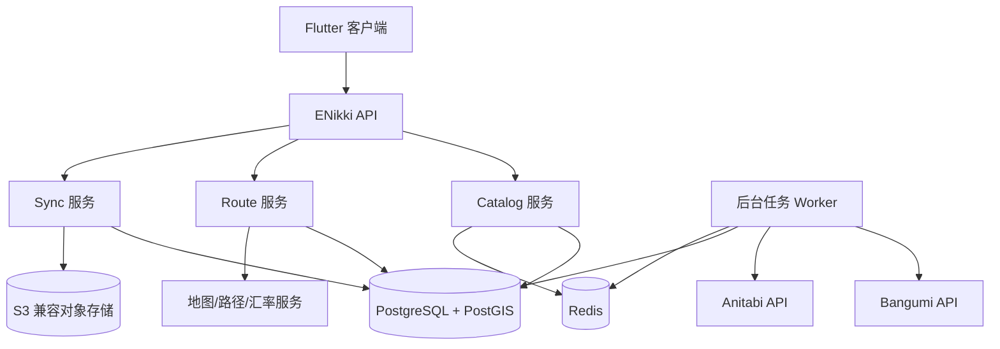

# ENikki 服务端架构

> 状态：分阶段设计  
> 日期：2026-09-14  
> 结论：P1 有轻量数据服务，但不是本地核心功能的唯一依赖；P2 再增加可选同步服务。

## 1. 先回答问题

ENikki 有服务端，但不是所有功能都必须经过服务端。

| 阶段 | 服务端状态 | 服务内容 |
| --- | --- | --- |
| P0 | 可以没有 | 只做本地模型、地图和排线验证 |
| P1 | 有无都可运行，但正式版本建议部署轻量数据服务 | Bangumi/Anitabi 聚合、缓存、第三方接口代理 |
| P2 | 可选部署同步服务 | 账号、跨设备同步、媒体备份、复杂路线优化 |

即使服务端完全不可用：

- 已缓存的行程、交通、住宿、餐次和预算仍可查看；
- 用户可以手动创建作品和点位；
- 用户可以修改时间线、预算和行程；
- 用户可以离线打卡、拍摄和记录；
- 用户可以导出和恢复 `.enikki` 数据包。

在线服务端用于减少客户端对第三方 API 的直接依赖，而不是成为核心行程的
所有者。

## 2. P1 轻量数据服务

P1 建议提供一个无账号的公共数据服务：

```text
Flutter 客户端
→ ENikki Data API
→ Bangumi Adapter
→ Anitabi Adapter
→ Route Provider
→ Exchange Rate Provider
→ Cache
```

负责：

- 代理 Bangumi 作品搜索和详情请求；
- 代理 Anitabi `lite` 和 `points/detail` 请求；
- 统一缓存第三方响应；
- 控制请求频率、重试和熔断；
- 保存数据来源、许可和更新时间；
- 为客户端返回规范化响应；
- 生成交通、住宿和餐厅的第三方跳转链接；
- 在服务端持有需要密钥的第三方 Provider 凭据。

不负责：

- 保存用户的完整行程；
- 保存支付信息或第三方账号；
- 代下单、支付和退款；
- 绕过第三方平台限制抓取数据；
- 保证实时班次、价格、房态或排队时间。

### 2.1 API

```text
GET  /v1/works/search?q=
GET  /v1/works/{bangumiId}
GET  /v1/works/{bangumiId}/spots
GET  /v1/routes/preview
POST /v1/routes/matrix
GET  /v1/providers/booking-links
GET  /v1/exchange-rates
GET  /v1/health
```

P1 不提供持久化用户行程 API。客户端传入排线请求，服务端只返回计算结果。

### 2.2 缓存

| 数据 | 缓存方式 |
| --- | --- |
| Bangumi 作品详情 | 按 subjectID 缓存，保留来源时间 |
| Anitabi 作品点位 | 按 subjectID 和 `modified` 条件更新 |
| 图片 | 优先客户端缓存，是否代理取决于授权 |
| 汇率 | 保存来源、生效时间和最后成功值 |
| 路线矩阵 | 短期缓存，不跨用户的私人坐标复用 |
| 搜索 | 短时缓存归一化关键词 |

缓存必须遵守第三方 API 条款，不因为技术上可以保存就无限期镜像数据。

## 3. P2 同步服务

只有用户主动开启账号后才启用：

- 行程结构化数据同步；
- 交通、住宿、餐次和预算同步；
- 图片和参考图可选备份；
- 多设备操作日志；
- 冲突检测和恢复；
- 账号导出与删除；
- 服务端路线优化。

未登录用户继续使用本地模式，不强制注册。

## 4. 系统组件



P1 只需要：

- API；
- Catalog；
- Worker；
- PostgreSQL；
- Redis（可先不启用）；
- Bangumi/Anitabi Adapter。

Route、Sync 和对象存储可以在 P2 加入。服务保持模块化单体，不提前拆成微服务。

## 5. 技术栈

| 组件 | 推荐实现 |
| --- | --- |
| Web 框架 | Python + FastAPI |
| 数据库 | PostgreSQL |
| 空间能力 | 接入路线功能后再启用 PostGIS |
| 缓存/队列 | Redis，按需要启用 |
| 对象存储 | S3 兼容，P2 使用 |
| 部署 | Docker Compose |
| API 文档 | OpenAPI |
| 可观测性 | 结构化日志、健康检查、错误追踪 |
| 许可 | AGPL-3.0，部署者需提供对应源码 |

如果 P1 只有很少的缓存需求，可以先用单实例 PostgreSQL，不启用 PostGIS、
Redis 和对象存储，避免过早复杂化。

## 6. 客户端降级策略

客户端必须把服务端当作可失败依赖：

```text
请求服务端
├── 成功：更新缓存
├── 超时：读取上次缓存
├── 限流：退避并显示稍后重试
├── Schema 不兼容：停止写入并保留本地数据
└── 完全离线：使用本地数据或手动创建
```

任何服务端错误都不能阻塞：

- 查看已有行程；
- 编辑时间、顺序和预算；
- 离线打卡；
- 数据导出。

## 7. 账号与安全

P1：

- 不要求账号；
- 可以用匿名设备标识做限流，但不能关联精确位置或身份；
- 服务端不保存用户完整行程；
- 第三方密钥保存在服务端环境变量或密钥管理中；
- 客户端不包含第三方密钥。

P2：

- OAuth 使用系统浏览器和 PKCE；
- 访问令牌短期化、最小权限；
- 支持账号导出和删除；
- 删除覆盖数据库、对象存储和备份保留策略；
- 日志脱敏，不记录令牌、订单号、电话和精确地址。

## 8. 许可和部署

ENikki 服务端继续使用 AGPL-3.0。部署修改后的网络服务时，必须向网络用户
提供对应源代码和修改说明。

推荐提供：

- `docker-compose.yml`；
- `.env.example`；
- 数据库迁移；
- 健康检查；
- 备份和恢复文档；
- 数据源许可证清单；
- 关闭 Anitabi 等第三方数据源的配置开关。

## 9. P1 验收标准

- 未启动服务端时，客户端可以使用本地缓存和手动录入完成核心流程。
- 启动服务端后，Bangumi 搜索和 Anitabi 点位查询不需要客户端密钥。
- 第三方接口超时不会导致应用崩溃或丢失本地数据。
- 所有缓存响应都能追踪来源和更新时间。
- 服务端不保存用户行程、预订账号或支付信息。
- Docker Compose 可以在单机完成部署和升级。
- AGPL 源码入口在服务端界面或文档中可访问。
