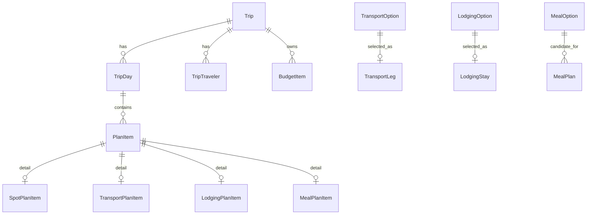

# 交通、住宿、用餐与预算的技术实现

> 状态：P1 技术设计  
> 日期：2026-09-14  
> 关联文档：[产品范围](TRIP_PLANNING.md)、[总体方案](IMPLEMENTATION_PLAN.md)

## 1. 实现目标

程序需要把交通、住宿、用餐、巡礼点和预算组合成一条可执行时间线，而不是
分别维护四组孤立列表。

核心要求：

- 用户数据默认保存在本地，离线仍可编辑和查看。
- 交通、住宿和餐次都能成为时间线中的固定或可调整节点。
- 排线器同时检查时间、地点、预约、入住退房、用餐和预算约束。
- 所有金额使用精确类型计算。
- 第三方数据与预订链接可替换，不污染核心领域模型。
- 后续接入同步时，不需要重写行程结构。

## 2. 推荐程序结构

继续使用既定技术栈：

| 层 | 实现 |
| --- | --- |
| UI | Flutter Widget |
| 状态管理 | Riverpod Notifier/AsyncNotifier |
| 领域层 | 纯 Dart 实体、值对象、规则和计算器 |
| 应用层 | 用例与命令 |
| 数据层 | Repository、Drift、远端 Adapter |
| 本地数据库 | SQLite + Drift |
| 时间 | UTC 存储 + IANA 时区展示 |
| 金额 | 最小货币单位整数 + Decimal 汇率 + 双币种显示 |
| 外链 | url_launcher + 域名白名单 |
| 导出 | ZIP + JSON + 校验和 |

建议目录：

```text
lib/
├── features/
│   ├── planner/
│   │   ├── domain/
│   │   ├── application/
│   │   ├── data/
│   │   └── presentation/
│   ├── transport/
│   ├── lodging/
│   ├── meals/
│   └── budget/
└── core/
    ├── domain/
    ├── data/
    ├── scheduling/
    └── platform/
```

领域层不依赖 Flutter、Drift、HTTP 或第三方 SDK。

## 3. 统一时间线模型

使用 `PlanItem` 作为所有可排程对象的基类：

```dart
sealed class PlanItem {
  String get id;
  String get tripId;
  String get dayId;
  int get orderIndex;
  DateTime? get plannedStart;
  Duration? get plannedDuration;
  bool get isLocked;
  PlanItemStatus get status;
}

final class SpotPlanItem extends PlanItem {
  final String spotId;
}

final class TransportPlanItem extends PlanItem {
  final String transportLegId;
}

final class LodgingPlanItem extends PlanItem {
  final String lodgingStayId;
}

final class MealPlanItem extends PlanItem {
  final String mealPlanId;
}

final class NotePlanItem extends PlanItem {
  final String text;
}
```

`PlanItem` 负责时间线位置和状态，详细数据放在各自的领域实体中：

```dart
final class MealPlan {
  final String id;
  final MealType type;
  final TimeWindow? preferredWindow;
  final Duration plannedDuration;
  final Duration queueBuffer;
  final MealPlace place;
  final MealReservation? reservation;
  final Set<String> travelerIds;
  final DietaryRequirements dietaryRequirements;
  final String? note;
}

sealed class MealPlace {}

final class FixedMealPlace extends MealPlace {
  final String optionId;
}

final class AreaMealPlace extends MealPlace {
  final GeoArea area;
}

final class FlexibleMealPlace extends MealPlace {}
```

交通和住宿使用同样方式：

```dart
final class TransportLeg {
  final String id;
  final PlaceRef origin;
  final PlaceRef destination;
  final TransportMode mode;
  final DateTime? departureAt;
  final DateTime? arrivalAt;
  final Duration? duration;
  final Money? estimatedCost;
  final BookingLink? booking;
  final SourceMetadata source;
}

final class LodgingStay {
  final String id;
  final String? selectedOptionId;
  final DateTime checkInDate;
  final DateTime checkOutDate;
  final LocalTime checkInTime;
  final LocalTime checkOutTime;
  final Set<String> travelerIds;
  final BookingLink? booking;
}
```

## 4. 值对象

不要在各模块中重复使用裸 `double`、字符串日期和金额。

```dart
final class Money {
  final int minorUnits;
  final String currencyCode;
}

final class ExchangeRate {
  final Decimal rate;
  final String sourceCurrency;
  final String targetCurrency;
  final DateTime effectiveAt;
  final String source;
}

final class CurrencyDisplay {
  final String primaryCurrency;
  final String secondaryCurrency;
}

final class MoneyPair {
  final Money original;
  final Money primary;
  final Money secondary;
  final ExchangeRate primaryRate;
  final ExchangeRate secondaryRate;
}

final class TimeWindow {
  final DateTime start;
  final DateTime end;
  final String timeZoneId;
}

final class GeoPoint {
  final double latitude;
  final double longitude;
}
```

规则：

- `Money` 的加减乘只能在同币种内直接计算。
- 跨币种先通过 `ExchangeRate` 转换。
- 汇率使用 Decimal，不使用二进制浮点数。
- `MoneyPair` 同时保留原值、基准币种值和第二显示币种值。
- 换算值只用于展示和汇总，不能覆盖费用原值。
- 时间存 UTC，同时保存 IANA 时区，例如 `Asia/Tokyo`。
- 跨夜住宿使用“日期 + 当地墙钟时间”，转换后再存 UTC。
- 日期范围和 TimeWindow 必须验证起止顺序。

## 5. 数据库设计

Drift/SQLite 推荐使用“公共时间线表 + 类型明细表”。

### 5.1 公共表

```text
trips
trip_travelers
trip_days
plan_items
source_records
booking_links
exchange_rates
```

`plan_items` 保存：

- `id`、`trip_id`、`day_id`
- `type`：spot/transport/lodging/meal/note
- `order_index`
- `planned_start_utc`
- `planned_duration_seconds`
- `time_zone_id`
- `status`
- `is_locked`
- `created_at`、`updated_at`、`revision`

### 5.2 类型明细表

```text
spot_items
transport_legs
transport_options
lodging_areas
lodging_options
lodging_stays
meal_plans
meal_options
dietary_requirements
budget_items
```

关系：



这样既有统一排序和时间查询，又保留各类型的字段约束。

### 5.3 事务边界

一次用户操作只在一个数据库事务中完成：

```text
添加交通
├── 写 transport_legs
├── 写 plan_items
├── 更新受影响日期的顺序
└── 重新计算预算摘要
```

失败时全部回滚，不能只保存了时间线却没有保存交通详情。

## 6. Repository 和用例

Repository 只负责持久化，不计算业务规则。

```dart
abstract interface class TripRepository {
  Future<Trip> getTrip(String tripId);
  Future<Trip> saveTransportPlan(TransportPlanningUpdate update);
  Future<Trip> saveLodgingPlan(LodgingPlanningUpdate update);
  Future<Trip> saveMealPlan(MealPlanningUpdate update);
  Future<Trip> saveBudgetItem(BudgetItem item);
  Future<Trip> movePlanItem(MovePlanItemCommand command);
  Future<OfflineManifest> prepareOffline(String tripId);
}
```

典型用例：

```text
CreateTrip
AddTraveler
AddTransportOption
SelectTransportOption
SetLodgingArea
AddLodgingOption
SelectLodgingStay
ScheduleMeal
SelectMealOption
AddBudgetItem
RecalculateDay
ValidateTrip
PrepareOffline
ExportTrip
```

每个用例输入命令，输出新的领域状态或明确错误，不能在 Widget 中直接拼 SQL。

### 6.1 计划总览内联编辑

计划总览是主要行程编辑器，不只是一个只读时间线。用户可以直接：

- 在任意事件之间插入新的 `PlanItem`；
- 编辑开始时间、结束时间、标题、地点、片区、提醒和备注；
- 添加巡礼点、交通、住宿、用餐、拍照打卡、休息和普通备注；
- 拍照打卡类型默认提供两个空图片框；参考图可选择 Anitabi、相册或文件，
  实拍图可选择拍照、相册或文件；
- 每组保存参考图、实拍图和对比模式，并允许继续添加多个对比组；
- 输入 CNY 与 JPY，或输入原币种后自动换算；
- 拖动调整顺序，锁定固定预约和交通；
- 复制、删除、撤销和恢复安排；
- 从地图或候选列表选择地点，不必手工复制坐标。

每次编辑都生成一个应用层命令，例如：

```text
AddPlanItem
UpdatePlanItem
DeletePlanItem
DuplicatePlanItem
MovePlanItem
ReorderPlanItems
LockPlanItem
ChangePlanItemType
```

命令完成后再统一执行：

```text
校验时间与预约冲突
→ 更新数据库事务
→ 重算交通衔接
→ 重算双币种预算
→ 更新离线准备状态
```

UI 可以乐观更新，但数据库失败时必须回滚到上一个有效版本。

## 7. Riverpod 状态组织

不要创建覆盖整个应用的单体 Controller。按职责拆分：

```dart
final tripRepositoryProvider = Provider<TripRepository>(...);

final activeTripProvider =
    AsyncNotifierProvider<ActiveTripNotifier, Trip>(...);

final tripTimelineProvider = Provider<List<PlanItem>>((ref) {
  final trip = ref.watch(activeTripProvider).valueOrNull;
  return buildTimeline(trip);
});

final budgetSummaryProvider = Provider<BudgetSummary>((ref) {
  final trip = ref.watch(activeTripProvider).valueOrNull;
  return BudgetCalculator.calculate(trip);
});

final dayValidationProvider = Provider.family<DayValidation, String>(...);
```

更新流程：

```text
Widget 触发用例
→ Notifier 调用 Repository
→ Repository 返回新 Trip
→ activeTripProvider 更新
→ 时间线、预算和校验 Provider 自动重算
```

UI 不保存第二份真相，只显示 Provider 派生的数据。

## 8. 排线程序

排线不是单独处理点位，而是处理所有 `PlanItem`。

### 8.1 固定项与可移动项

固定项：

- 已预约餐厅；
- 已订城际交通；
- 酒店入住和退房时间；
- 用户锁定项；
- 有严格开放时间的场地。

可移动项：

- 普通巡礼点；
- 未预约餐厅；
- 步行和市内交通；
- 弹性休息；
- 自由活动。

算法首先固定硬约束，再在剩余时间段插入可移动项。

### 8.2 单日规划流程

```text
读取当天起始住宿、结束住宿和固定项
→ 将一天切成多个可用时间段
→ 为每个时间段计算候选点位和餐厅
→ 计算交通时间、停留时间、排队和缓冲
→ 生成顺序
→ 检查预约、营业、首末班车和总预算
→ 返回方案和冲突说明
```

伪代码：

```dart
Future<PlanningResult> planDay(DayPlanningRequest request) async {
  final matrix = await routeMatrix.calculate(request.places);
  final anchors = request.items.where((item) => item.isFixed).toList();
  final segments = splitTimeline(request.day, anchors);
  final candidates = segmentPlanner.plan(segments, matrix, request);
  final validated = validator.validate(candidates, request);
  return planner.repair(validated, request);
}
```

### 8.3 交通衔接

- 使用 `RouteProvider` 获取距离、时长和路径摘要。
- 路径数据缺失时用球面距离和固定速度估算。
- 估算结果必须标记 `estimated`，不能显示成实时班次。
- 公共交通使用地区的 GTFS/OpenTripPlanner 数据。
- 实时班次、票价和导航交给第三方服务。
- 换乘不足时返回具体冲突，例如“到达时间晚于末班车 18 分钟”。

### 8.4 用餐插入

餐次按以下优先级安排：

1. 固定预约餐厅；
2. 有时间窗的候选餐厅；
3. 区域用餐；
4. 完全弹性餐次。

区域用餐的候选排序：

```text
score =
  travel_time_weight
  + queue_weight
  + price_weight
  + dietary_match
  + opening_hours_match
  + route_detour_penalty
```

如果餐厅预约与点位冲突，返回三种修复方案：

- 移动前一个巡礼点；
- 缩短前一个点位停留时间；
- 替换餐厅或改为区域用餐。

### 8.5 住宿约束

每天时间线以住宿为起点和终点。算法检查：

- 早餐时间是否与出发时间冲突；
- 最晚入住时间是否满足；
- 早班交通是否需要提前退房；
- 行李寄存是否影响白天路线；
- 更换住宿日是否有足够的移动和入住时间。

### 8.6 算法阶段

P1 不需要立即实现复杂 VRP：

- 优先完成约束校验、手动排序和冲突提示。
- 10 至 15 个点使用插入启发式和 2-opt。
- 固定预约作为不可移动锚点。
- 更大规模或复杂约束再交给服务端 OR-Tools。
- 所有结果允许用户拖动、锁定和撤销。

## 9. 预算计算

预算分为“输入项”和“派生摘要”。

输入项是 `BudgetItem`：

```dart
final class BudgetItem {
  final String id;
  final String tripId;
  final BudgetCategory category;
  final Money amount;
  final BudgetKind kind;
  final String? linkedItemId;
  final Set<String> travelerIds;
  final PaymentStatus paymentStatus;
  final String? note;
}
```

派生摘要包括：

```text
原币种总额
基准币种总额
第二显示币种总额
分类小计
每人小计
每天预算和剩余金额
预估与实际差额
已支付和待支付金额
```

预算页面同时显示两种币值，例如 `CNY 18,640 / JPY 382,000`。汇率过期时
继续使用最后一次成功值，但必须显示来源和更新时间。

计算器应是纯函数：

```dart
BudgetSummary calculateBudget(
  Trip trip,
  List<BudgetItem> items,
  RateTable rates,
);
```

导出时不只保存总额，还保存形成总额的汇率、分摊方式和预算项快照。

## 10. 外部数据适配器

领域层只依赖接口：

```dart
abstract interface class TransportProvider {
  Future<List<TransportOption>> search(TransportQuery query);
}

abstract interface class LodgingProvider {
  Future<List<LodgingOption>> search(LodgingQuery query);
}

abstract interface class MealProvider {
  Future<List<MealOption>> search(MealQuery query);
}

abstract interface class RouteProvider {
  Future<RouteResult> route(RouteRequest request);
}
```

P1 可以先提供“手动录入 Provider”，之后再实现：

- 交通查询和第三方预订跳转；
- 住宿区域与酒店查询；
- 餐厅、营业时间和预约跳转；
- 路径规划与时间矩阵；
- 汇率查询。

所有 Provider 返回统一 `SourceMetadata`：

```text
source_name
source_url
observed_at
valid_until
license
confidence
```

第三方密钥不能进入客户端。需要密钥的查询走 ENikki 后端。

## 11. 外链和预订

只实现深链接跳转：

```dart
abstract interface class BookingLinkBuilder {
  Uri build(BookingTarget target);
}

final class BookingTarget {
  final BookingType type;
  final String provider;
  final Map<String, String> parameters;
}
```

流程：

```text
用户选择一个交通、住宿或餐厅方案
→ 生成白名单第三方链接
→ 打开系统浏览器或目标 App
→ 用户完成第三方交易
→ 回到 ENikki
→ 用户自行填写订单摘要和实际价格
```

安全要求：

- URL scheme 只允许 `https` 和明确允许的 App scheme。
- 域名白名单。
- 禁止把第三方登录页嵌入 WebView。
- 不在日志中记录订单号、姓名、电话和支付信息。
- 推广链接必须明确披露。

## 12. 离线实现

离线包由 `OfflineReadinessService` 生成：

```text
必要数据
├── 行程和每日时间线
├── 交通班次与预订摘要
├── 住宿地址和入住退房时间
├── 每日餐次、餐厅和预约
├── 预算摘要
├── 点位和参考图缓存
└── 地图缓存（如果许可允许）
```

状态：

```text
ready       已缓存完成
partial     核心数据可用，部分图片或地图缺失
blocked     关键交通、住宿或预约信息缺失
```

首页应显示“离线准备”检查项，并允许用户只重新缓存失败项目。

数据结构使用：

```sql
CREATE TABLE offline_assets (
  trip_id TEXT NOT NULL,
  asset_type TEXT NOT NULL,
  entity_id TEXT NOT NULL,
  local_path TEXT,
  sha256 TEXT,
  status TEXT NOT NULL,
  checked_at INTEGER NOT NULL
);
```

媒体文件使用内容寻址，避免重复保存同一张参考图。

## 13. 导入导出

`.enikki` 文件是带清单的 ZIP：

```text
manifest.json
data/trip.json
data/items.jsonl
data/budget.jsonl
data/records.jsonl
media/<sha256>.<ext>
checksums.sha256
```

导入流程：

```text
读取 manifest
→ 校验 schema_version 和 checksums
→ 检查路径穿越和文件大小
→ 生成导入预览
→ 用户选择计划/记录/媒体
→ 事务导入
→ 失败回滚
```

结构数据使用 JSON，照片和参考图使用内容哈希。这样便于长期迁移和第三方工具处理。

## 14. 测试方案

### 14.1 单元测试

- Money 加减、舍入、双币种换算、汇率时间和退款。
- 住宿入住退房、跨天和时区。
- 交通连接、末班车和换乘缓冲。
- 早餐、午餐、晚餐时间窗和预约约束。
- 餐厅过敏和饮食要求匹配。
- 时间线排序和锁定项。
- 预算分摊、汇率和差额。
- 导入导出版本迁移和非法路径。

### 14.2 仓储测试

- 每个用例使用真实 SQLite 内存数据库。
- 验证事务回滚。
- 验证 schema migration。
- 验证删除交通、住宿或餐次后时间线一致。

### 14.3 集成测试

```text
创建三天行程
→ 添加 20 个点位
→ 添加往返交通
→ 选择住宿
→ 安排三餐和预约
→ 修改汇率
→ 校验预算
→ 导出
→ 新数据库导入
→ 数据完全一致
```

### 14.4 Provider 契约测试

用固定 Fixtures 验证每个交通、住宿、餐饮、路径和汇率 Provider 的输出映射。
外部接口变化时，测试应先定位到具体 Adapter。

## 15. 开发顺序

1. 建立 Flutter、Riverpod、Drift 和测试骨架。
2. 完成 Money、TimeWindow、时区和 GeoPoint。
3. 建立 Trip、TripDay、PlanItem 和四类明细表。
4. 完成 Repository 事务和 schema migration。
5. 完成预算计算器和单元测试。
6. 完成手动交通、住宿、餐次录入。
7. 完成时间线、冲突校验和手动排序。
8. 接入路线、地图、地点和汇率 Provider。
9. 完成第三方预订和预约深链接。
10. 完成离线检查、`.enikki` 导入导出和端到端测试。

交通、住宿、用餐和预算必须在同一阶段联调，不能等基础巡礼功能完成后再各自
追加，否则数据模型和排线逻辑会被迫重写。
