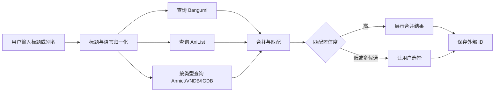

# 作品搜索数据源方案

> 状态：建议稿  
> 调研日期：2026-09-13  
> 目标：让 ENikki 不依赖单一作品搜索 API，同时保证 Anitabi 点位可以正确关联。

## 1. 结论

可以使用其他数据源搜索作品，而且应该使用多源方案。

但必须区分两个概念：

- **作品搜索**：获取标题、别名、年份、类型、封面和外部 ID。
- **巡礼数据导入**：获取作品对应的点位和截图。

作品可以由 AniList、Jikan、Annict、VNDB、IGDB 等来源找到，但 Anitabi
公开接口目前要求 Bangumi `subjectID`。因此搜索到作品后，ENikki 还需要：

1. 查找该作品的 Bangumi ID；或
2. 在多个 Bangumi 候选中让用户确认；或
3. 让用户粘贴 Bangumi 作品地址或 `subjectID`。

未确认 Bangumi ID 时，作品仍可进入 ENikki 行程，但不能自动导入 Anitabi 点位。

## 2. 推荐分层

| 作品类型 | 首选来源 | 后备来源 | 说明 |
| --- | --- | --- | --- |
| 动画 | Bangumi | AniList、Annict、Jikan | Bangumi 优先用于 Anitabi 对接 |
| 漫画 | Bangumi | AniList、MangaDex（待评估） | AniList 覆盖常见漫画 |
| 游戏 | Bangumi | IGDB | IGDB 需要 Twitch 凭据并审查条款 |
| 视觉小说 | VNDB | Bangumi、IGDB | VNDB API 明确仅免费用于非商业用途 |
| 小说/轻小说 | Bangumi | Open Library、Google Books | 后两者 ACG 元数据覆盖有限 |
| 跨平台 ID | Wikidata | 人工确认 | Wikidata 为 CC0，适合别名与 ID 对齐 |
| 兜底方式 | 手动添加 | Bangumi 链接导入 | 保证新作或冷门作品仍可使用 |

### 2.1 Bangumi

用途：

- ENikki 的主要中文 ACG 元数据来源。
- 为 Anitabi 查询提供 `subjectID`。
- 支持动画、漫画、游戏、小说等多种条目。

注意事项：

- 调用时使用清晰、稳定的 `User-Agent`。
- 遵守 API 条款、频率限制和内容许可。
- 搜索 API 或网络不可用时不能阻塞 ENikki 启动。
- 不能把搜索结果永久视为权威数据，用户应能修正。

### 2.2 AniList

用途：

- 动画和漫画的多语言标题、别名、年份、类型和外部 ID。
- 英文、罗马字和日文标题互相补充。
- 在 Bangumi 不可用或搜索不到时作为主要后备。

注意事项：

- 使用 GraphQL；服务端应集中调用并缓存。
- 官方文档说明常规限制为每分钟 90 次，曾进入每分钟 30 次的降级状态。
- 必须处理 `429`、突发限制和响应头中的动态额度。
- 封面、简介等内容的许可和商业使用条款需要单独审查。

### 2.3 Jikan

Jikan 提供 MyAnimeList 数据的非官方镜像 API。

适合：

- 开发期兼容和元数据补充。
- 用户明确选择的备用数据源。

不适合：

- 作为唯一生产依赖。
- 需要稳定 SLA 的场景。
- 未经审查的商业分发。

ENikki 应记录“数据来自 MyAnimeList/Jikan”，不能把其数据当作自有数据。

### 2.4 Annict

Annict 适合日本动画元数据，并同时提供 REST 和 GraphQL API。

适合：

- 日文标题、季度、放送信息和作品关联。
- 日本地区用户或日文界面。

注意事项：

- API 请求通常需要个人访问令牌或 OAuth。
- 令牌只能保存在服务端，不能打包进客户端。
- 使用前需要审查作品数据许可和署名要求。

### 2.5 VNDB

VNDB 适合视觉小说和 galgame。

- 提供标题、别名、发行日期、封面和平台等数据。
- API 文档明确说明服务仅免费用于非商业用途。
- 数据还受 VNDB 单独的数据许可约束。
- 商业化前必须取得授权或移除该数据源。

### 2.6 IGDB

IGDB 适合一般电子游戏。

- 需要 Twitch 应用凭据，由 ENikki 后端换取令牌。
- 数据覆盖范围比 Bangumi 和 VNDB 更广。
- 必须遵守 IGDB、Twitch 和游戏封面权利方的条款。
- 客户端不得持有 `Client Secret`。

### 2.7 Wikidata 与 Wikipedia

Wikidata 适合：

- 保存跨平台的稳定 ID 映射。
- 获取别名、原作、改编关系和年份。
- 利用 CC0 数据建立基础对齐表。

不适合：

- 作为主要作品简介和封面来源。
- 当作完整、及时的作品目录。

Wikipedia 可用于补充背景资料，但不能未经审核直接写入核心数据。

## 3. 内部模型

ENikki 必须拥有独立于外部平台的 `Work.id`，推荐使用 UUID v7 或 ULID。

外部 ID 单独保存：

| 字段 | 示例 |
| --- | --- |
| `provider` | `bangumi`、`anilist`、`annict`、`vndb`、`igdb` |
| `external_id` | `115908`、`20912`、`v2002` |
| `source_url` | 来源条目地址 |
| `matched_by` | `exact_id`、`title_year`、`manual` |
| `confidence` | 0.0 至 1.0 |
| `verified_at` | 最后人工或自动确认时间 |

统一搜索结果结构建议为：

```json
{
  "provider": "anilist",
  "provider_id": "20912",
  "title_native": "響け！ユーフォニアム",
  "title_romaji": "Hibike! Euphonium",
  "title_zh": "吹响吧！上低音号",
  "title_en": "Sound! Euphonium",
  "aliases": [],
  "type": "anime",
  "year": 2015,
  "external_ids": {
    "anilist": "20912",
    "bangumi": "115908"
  },
  "source_url": "https://anilist.co/anime/20912"
}
```

不得把 provider 的 ID 直接当作 ENikki 主键，也不得把不同平台的标题强行覆盖。
所有字段应保留“来源值”和“用户确认值”。

## 4. 聚合搜索流程



处理规则：

- 完全相同的 provider ID 可以直接合并。
- 存在经过验证的跨平台 ID 时可以自动合并。
- 只有标题相似时，不得静默合并；标题、年份、类型和原名至少满足多项。
- 多季作品、剧场版、总集篇和重制版必须保留为独立作品，除非有明确关系。
- 用户可选择“这是同一作品”，并把确认写入外部 ID 映射。
- 用户可手动拆分错误合并，系统必须支持撤销。

### 4.1 Bangumi ID 解析

当作品来自其他来源时，按以下顺序查找 Bangumi ID：

1. 读取外部 ID 映射表中的 `bangumi` 字段。
2. 用原生标题、罗马字标题、中文标题和年份查询 Bangumi。
3. 比较作品类型、年份、别名和关联 ID。
4. 只有一个高置信候选时自动填入，但仍要求用户确认。
5. 有多个候选时展示标题、年份、类型和封面让用户选择。
6. 无法确定时保留“未关联 Anitabi”，允许用户稍后处理。

### 4.2 手动关联

每个导入 Anitabi 的弹窗都应提供：

- 自动匹配的 Bangumi 作品；
- “重新选择作品”；
- “粘贴 Bangumi URL 或 ID”；
- “暂不导入 Anitabi”；
- 关联来源和匹配置信度。

## 5. 缓存与限流

- 每个 provider 单独设置超时、并发限制和退避策略。
- 搜索请求在服务端缓存，使用归一化关键词和作品类型作为缓存键。
- 缓存命中结果仍要返回来源、更新时间和是否过期。
- 不允许通过多个客户端绕过 provider 限流。
- provider 故障时返回其他来源结果，而不是让整个搜索失败。
- 客户端保留最近搜索历史，但用户可以清除。
- 离线时不调用远端搜索，只搜索本地作品库。

## 6. 许可与署名

ENikki 源代码使用 AGPL-3.0，不自动覆盖第三方元数据、简介和封面。

必须按 provider 记录：

- 数据来源名称和条目 URL；
- 数据许可；
- 封面和简介的权利说明；
- 是否允许缓存、翻译和商业使用；
- 删除与更正流程。

搜索结果中出现第三方内容时，应在详情页提供“数据来源”入口。未知许可的数据
不得进入仓库、测试 Fixtures、安装包或公开导出文件。

## 7. 分阶段实施

### P0

- 定义 `WorkSearchProvider` 接口和统一结果模型。
- 接入 Bangumi 与 AniList 两个来源。
- 验证标题归一化、多季作品和 Bangumi ID 匹配。
- 建立 provider 级缓存、限流和错误隔离。

### P1

- 搜索页支持来源切换和聚合结果。
- 支持手动关联 Bangumi ID。
- 只有确认 Bangumi ID 后才显示“导入 Anitabi 点位”。
- 保存外部 ID 和匹配依据。

### P2

- 按作品类型接入 Annict、VNDB、IGDB。
- 使用 Wikidata 辅助 ID 对齐。
- 增加别名、罗马字、简繁转换和模糊搜索。
- 建立数据源权限开关、纠错和失效监测。

## 8. 推荐决定

首版实现 **Bangumi + AniList**：

- Bangumi 负责中文 ACG 覆盖和 Anitabi 关联。
- AniList 负责多语言标题和在 Bangumi 不可用时的后备搜索。
- VNDB、IGDB、Annict 等通过适配层逐步增加，不阻塞核心行程闭环。
- Jikan 只作为可选兼容源，不作为关键依赖。
- Wikidata 用于 ID 对齐，不直接承担用户可见的作品详情。
